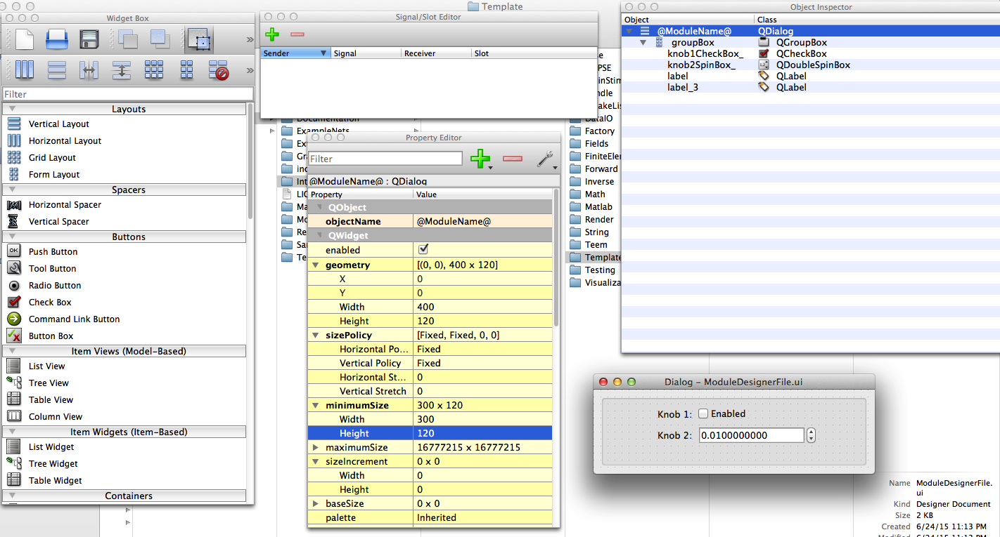
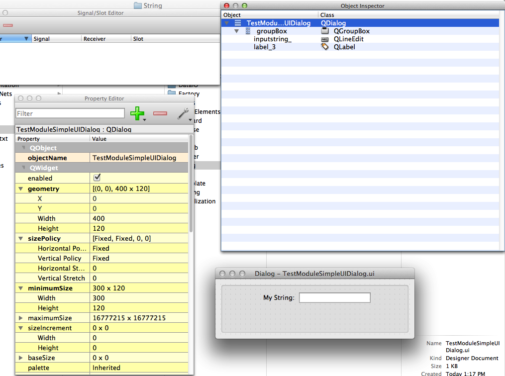
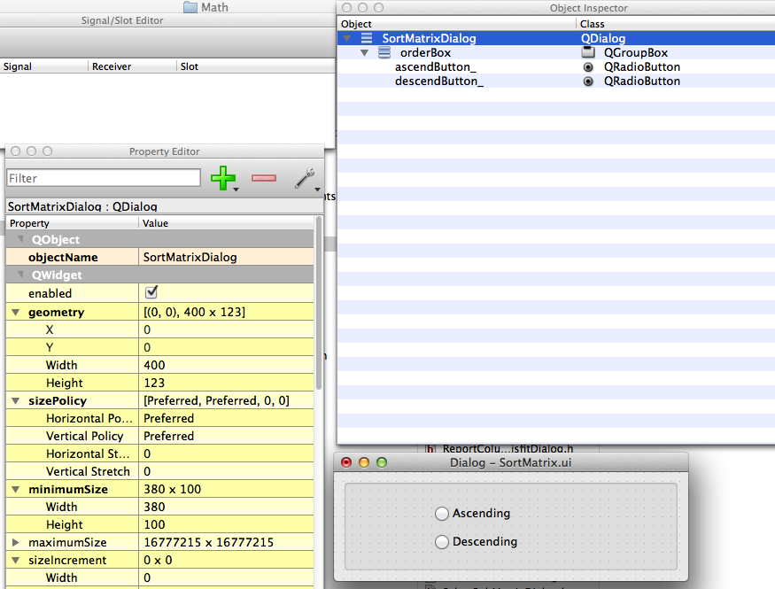
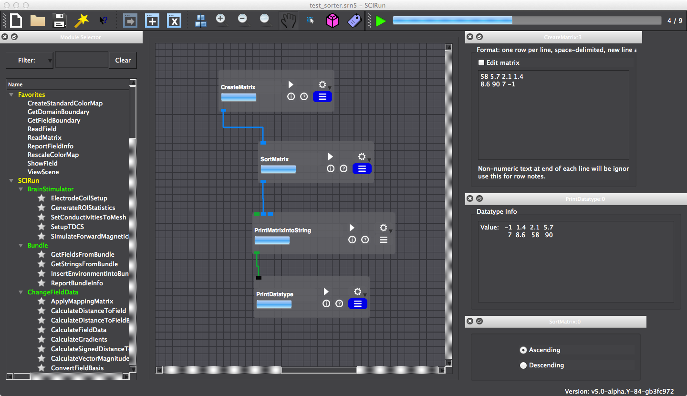

# SCIRun Module Generation

This project was supported by grants from the National Center for Research Resources
(5P41RR012553-14) and the National Institute of General Medical Sciences
(8 P41 GM103545-14) from the National Institutes of Health.

&nbsp;

Authors:  
Jess Tate and Garima Chhabra

## SCIRun Overview

**This tutorial demonstrates how to create new modules in SCIRun 5.0.  It will walk through all the files needed and the basic module structure used by modules.  These instructions assume a basic understanding in C++ coding and other basic programming skills**

### Software requirements

#### SCIRun 5.0

Download SCIRun version 5.0 from the [SCI software portal](http://www.scirun.org).

Make sure to update to the most up-to-date version of the source code available, which will include the latest bug fixes.

Alternatively, use Git to clone the SCIRun [repository](https://github.com/SCIInstitute/SCIRun.git). We suggest creating a fork of the repository so that you can track your changes and create pull requests to the SCIRun repository ([Creating Your SCIRun Fork](#creating-your-scirun-fork)).

#### Compilers, Dependencies Development Tools

SCIRun will need to be built from the source code in order to test and use any modules written. Make sure that Qt, Git, CMake, and the latest C++ compilers for the operating system are installed. More detailed build instructions are available, [Building SCIRun](../start/build.md).

#### Creating Your SCIRun Fork

With your own GitHub account, go to the [SCIRun GitHub page](https://github.com/SCIInstitute/SCIRun). Click the fork button on the upper right side of the page. It will ask you where to move the fork to, chose your own account. Once the repository is forked, clone it to your local machine with the following command.  

```
$git clone https://github.com/[yourgithubaccount]/SCIRun.git
```

After the the code is cloned, navigate to the repository directory and add the upstream path to the original SCIRun repository.  

```
$git remote add upstream https://github.com/SCIInstitute/SCIRun.git
```

You should be able to see both your and the original repositories when you use the command:     

```
$git remote -v
```

The fork is good to go, but you will need to sync the fork occasionally to keep up with the changes in the main repository. To sync your fork, use the following commands:

```
$git fetch upstream

$git checkout master

$git merge upstream/master
```

You should sync and merge your fork before you start a new module and before you create a pull request.  

It is a good practice to create a new branch in your fork for every module you will be adding. The command to create a new branch is:

```
$git checkout -b [branch_name]
```

Please see the [GitHub help page](https://help.github.com) for more information.

## Files Needed for a New Module

**This section describes the files need to create a module in SCIRun. Each file is described and a template example provided. These template files are all included in the source code in the template directories.**

### Overview of Files Needed for each Module

There are only three files required to create a module, though more may be needed depending on the function of the module.

In addition to the required module source code and header files *modulename.cc* and *modulename.h*, a module configuration file is needed. The module configuration file *modulename.module* contains a description of the module and its state and names all the files needed for the module to be included in SCIRun.

Simple modules without user interfaces (UIs) can be created with the previously listed three files alone.

However, if the module function needs a UI, there are three additional files needed.  

SCIRun can generate a UI for a module without these, but the functionality is limited to nonexistent.

The Qt UI file *modulenameDialog.ui* that describes the graphics and hooks of the UI is created using the Qt UI editor. Module UIs also require source code and header files; *modulenameDialog.cc* and *modulenameDialog.h*.    

Most modules, especially those requiring more than minimal code, should also have algorithm code to allow for greater portability and code control. The algorithm code and header files; *modulenameAlgo.cc* and *modulenameAlgo.h*, contain all the computation of the module.

Though it is possible to build modules without algorithm files, it is considered good practice to do so.  

It is worth noting that each of the *CMakeLists.txt* files are in the directories of all of the files (except the module config file). See the examples in the following chapters for details.

### Module Configuration File

The module configuration file contains all the information needed for the module factory to create necessary linkage and helper files for modules to be properly included into SCIRun.  The module configuration file is located in `src/Modules/Factory/Config/`. It is a text file that describes fields specific to the module delimited by curly brackets.  

There are three fields: "module", "algorithm", and "UI" and within each field are subfields "name" and "header", and others depending on the field. The following is an example that reflects the template files included in the source code.

```
{
  "module": {
    "name": "@ModuleName@",
    "namespace": "Fields",
    "status": "description of status",
    "description": "description of module",
    "header": "Modules/Template/ModuleTemplate.h"
  },
  "algorithm": {
    "name": "@AlgorithmName@Algo",
    "namespace": "Fields",
    "header": "Core/Algorithms/Template/AlgorithmTemplate.h"
  },
  "UI": {
    "name": "@ModuleName@Dialog",
    "header": "Interface/Modules/Template/ModuleDialog.h"
  }
}
```

This config file example would not build.  Specific examples that build and work are found in the following sections of this tutorial ([Simple Module Without UI](#example-simple-module-without-ui), [Simple Module With UI](#example-simple-module-with-ui), [Simple Module With Algorithm](#example-simple-module-with-algorithm)).  

As mentioned before, the UI and algorithm files are not required to generate a module, therefore the subfields for the "algorithm" or "UI" fields can be changed to "N/A" to indicate that these files do not exist. Please refer to [Module Config File](#module-config-file) section for an example.

### Module Source Code

The Module source code consist of a .cc and .h file that code the actual function of the module. However, since most modules use an algorithm file, these files can also be considered as the code that pulls all the relevant information from the algorithm, the UI, and other modules in order to achieve its proper function. These files should be located in the proper directory with the `src/Modules/` directory. For example purposes, we will show and discuss the template files included in the `src/Modules/Template/` directory.

#### Module Header File

The module header file functions as a typical C++ header file, containing code establishing the module object and structure. The *ModuleTemplate.h* file found in `src/Modules/Template/` provides an example of the kind of coding needed for a module header. The relevant functions are included here, with annotated comments:

```
// makes sure that headers aren't loaded multiple times.
// This requires the string to be unique to this file.
// standard convention incorporates the file path and filename.
 #ifndef MODULES_FIELDS_@ModuleName@_H__
 #define MODULES_FIELDS_@ModuleName@_H__

 #include <Dataflow/Network/Module.h>
 #include <Modules/Fields/share.h>
// share.h must be the last include, or it will not build on windows systems.

namespace SCIRun {
namespace Modules {
namespace Fields {
// this final namespace needs to match the .module file
// in src/Modules/Factory/Config/

  // define module ports.  
  // Can have any number of ports (including none), and dynamic ports.
  class SCISHARE @ModuleName@ : public SCIRun::Dataflow::Networks::Module,
    public Has1InputPort<FieldPortTag>,
    public Has1OutputPort<FieldPortTag>
  {
  public:
    // these functions are required for all modules
    @ModuleName@();
    virtual void execute();
    virtual void setStateDefaults();

    //name the ports and datatype.
    INPUT_PORT(0, InputField, Field);
    OUTPUT_PORT(0, OutputField, Field);

    // this is needed for the module factory
    // the arguments of this function could vary as NoAlgoOrUI or ModuleHasUIAndAlgorithm
    MODULE_TRAITS_AND_INFO(NoAlgoOrUI);
  };
}}}
    #endif
```

One of the key functions of this header file is the definition of the ports used by the module. This template uses one input and output, but any number can be used by changing the number and defining all the port types. To use two inputs and outputs:

```
public Has2InputPorts<FieldPortTag,FieldPortTag>,
public Has2OutputPorts<FieldPortTag,FieldPortTag>
```

If no there are no input or output ports, the commands are:

```
public HasNoInputPorts,
public HasNoOutputPorts
```

Dynamic ports are also possible for the inputs.  

Dynamic ports are essentially a vector of ports, and are counted as a single port in the header.

For a single dynamic port, then a static port and a dynamic port:

```
public Has1InputPort<DynamicPortTag<FieldPortTag>>,        
public Has2InputPorts<FieldPortTag,DynamicPortTag<FieldPortTag>>
```

Here is a list of port tags that can be used in SCIRun:

- MatrixPortTag
- ScalarPortTag
- StringPortTag
- FieldPortTag
- GeometryPortTag
- ColorMapPortTag
- BundlePortTag
- NrrdPortTag
- DatatypePortTag

The header is also where the ports are named and the datatype is declared. It is important for the name of each port to be unique, including all the inputs and outputs. The datatype of each port is specific when the port is declared and named.

This declares the datatype expected by the port and can be a subset of the port tag type, e.g., DenseMatrix instead of Matrix. However, it is better to do this within the module to control the exception.  

If there is a UI with the module in question, the state variables are needed to pass data between the module and the UI. State variables are declared here as public (see [Connecting UI to the Module](#connecting-ui-to-the-module) for an example). The `setStateDefault` function is how the default state variables are set. If there is no UI and therefore no state variables, this function is set to empty in this file (`virtual void setStateDefaults() {};`)  and omitted from the .cc file.

#### Module Code File

The module header file functions as a typical C++ file, containing the functions for the module. The *ModuleTemplate.cc* file found in `src/Modules/Template/` provides an example of the kind of coding needed for a module .cc file. The relevant functions are included here, with annotated comments:

```
#include <Modules/Fields/@ModuleName@.h>
#include <Core/Datatypes/Legacy/Field/Field.h>
#include <Core/Algorithms/Field/@ModuleName@Algo.h>

using namespace SCIRun::Modules::Fields;
using namespace SCIRun::Core::Datatypes;
using namespace SCIRun::Dataflow::Networks;
using namespace SCIRun::Core::Algorithms::Fields;

// this defines the location of the module in the module list.  
// "NewField" is the catagory and "SCIRun" is the package.

MODULE_INFO_DEF(@ModuleName@, NewField, SCIRun) ;


@ModuleName@::@ModuleName@() : Module(staticInfo_)
{
  //initialize all ports.
  INITIALIZE_PORT(InputField);
  INITIALIZE_PORT(OutputField);
}

void @ModuleName@::setStateDefaults()
{
  auto state = get_state();
  setStateBoolFromAlgo(Parameters::Knob1);
  setStateDoubleFromAlgo(Parameters::Knob2);
}

void @ModuleName@::execute()
{
  // get input from ports
  auto field = getRequiredInput(InputField);
  // get parameters from UI
  setAlgoBoolFromState(Parameters::Knob1);
  setAlgoDoubleFromState(Parameters::Knob2);
  // run algorithm code.  
  auto output = algo().run(withInputData((InputField, field)));
  //send to output port
  sendOutputFromAlgorithm(OutputField, output);
}
```

As shown in this template example, the module.cc file contains mostly constructors and sends the inputs to the SCIRun algorithm. Most modules should follow this practice, which allows for easier maintenance of common algorithms.

### Module UI Code

Three files are needed to set up a UI for a module; a design file, a header file, and a .cc file. These files are located in the same directory within `src/Interface/Modules/`.

We show the examples located in `src/Interface/Modules/Template` as examples of the core functions needed.

#### Module Design File

The module design file is an xml file that describes the UI structure. This file is created and edited in the Qt editor. The image below shows the example template *ModuleDesignerFile.ui* within the Qt editor.

:::{figure-md} fig-QT-Editor



Template module interface design file as seen in the Qt editor
:::

As shown, the user interactively modifies the placement of widgets in the window. The Widget Box window allows the user to choose and place new objects within the window. The Property Editor allows modification of properties of the various objects and widgets within the UI, including size, type of input, names, etc.  The hierarchy and organization of the UI can be changed within the Object Inspector window .

When using the editor to make a module UI, there are a few things to consider. First, make sure all the relevant objects, including the name of UI (QDialog) is consistent with module dialog code. You can change the size and placement of objects with the property manager, but make sure to leave some buffer space as some operating systems interpret the file slightly differently. The structure of the UI can be changed or destroyed.

Look at some of the existing modules for examples.

#### Module Dialog Header

The module dialog header performs as a traditional C++ header for the module dialog code. Shown here is the example *ModuleDialog.h* in the `src/Interface/Modules/Template` folder.

```
 #ifndef INTERFACE_MODULES_@ModuleName@DIALOG_H
 #define INTERFACE_MODULES_@ModuleName@DIALOG_H

//This file is created from the @ModuleName@Dialog.ui in the module factory.
 #include <Interface/Modules/Fields/ui_@ModuleName@Dialog.h>
 #include <boost/shared_ptr.hpp>
 #include <Interface/Modules/Base/ModuleDialogGeneric.h>
 #include <Interface/Modules/Fields/share.h>

namespace SCIRun {
namespace Gui {

class SCISHARE @ModuleName@Dialog : public ModuleDialogGeneric,
  public Ui::@ModuleName@
{
    Q_OBJECT

public:
  @ModuleName@Dialog(const std::string& name,
    SCIRun::Dataflow::Networks::ModuleStateHandle state,
    QWidget* parent = nullptr);
    //this function would be from pulling data from module,
    // usually to change the UI.
  void pull() override;
};
}}
 #endif
```

The module dialog header file is similar for each module, with only the names of the module and a few different functions declared.  

#### Module Dialog Code

The module dialog .cc file is used with Qt to establish the functionality of a module UI.

Shown here is the example *ModuleDialog.cc* in the `src/Interface/Modules/Template` folder.

```
#include <Interface/Modules/Fields/@ModuleName@Dialog.h>
#include <Core/Algorithms/Field/@ModuleName@Algo.h>

using namespace SCIRun::Gui;
using namespace SCIRun::Dataflow::Networks;
using namespace SCIRun::Core::Algorithms::Fields;

@ModuleName@Dialog::@ModuleName@Dialog(const std::string& name,
  ModuleStateHandle state,
  QWidget* parent /* = nullptr */)
  : ModuleDialogGeneric(state, parent)
{
  setupUi(this);
  setWindowTitle(QString::fromStdString(name));
  fixSize();

//get values from UI and send to algorithm
  addCheckBoxManager(knob1CheckBox_, Parameters::Knob1);
  addDoubleSpinBoxManager(knob2SpinBox_, Parameters::Knob2);
}

void @ModuleName@Dialog::pull()
{
// pull the code from the module and set in the dialog.
// make changes necessary.
  pull_newVersionToReplaceOld();
}
```

The module dialog code is used mostly for passing data between the module and the UI and changing the UI when required by the module. Parameters and inputs are passed straight to the algorithm, as shown in this example. The 'pull' functions are optional, and use data from the module and algorithm to either display in the UI or to change the options or appearance of the UI.  There are other forms of 'pull', such as `pullSpecial`. A `push` function can be used in conjunction with `pull`.

These functions, `pull` and `push` are automatic functions in the module UI.

### Algorithm Code

The Module algorithm files are where most of the computation code should live. There are two files, a header and a .cc file. Making algorithm files can be tricky for a beginner, because there are several options to use due to the flexible nature of SCIRun. However, the module algorithms have more in common than initially apparent.

The trick to implementing a new module algorithm (as with most things) is to look at several other modules that have similar functions and try to emulate those methods.  

Module algorithm code belongs in the relevant directory within the `src/Core/Algorithms/` directory.

 Some template examples are provided for this section, and are found in `src/Core/Algorithms/Template/`

#### Module Algorithm Header

The module algorithm header performs as a traditional C++ header for the module algorithm code.  The example *AlgorithmTemplate.h* found in the `src/Core/Algorithm/Template` folder is shown below.

```
#ifndef CORE_ALGORITHMS_FIELDS_@AlgorithmName@_H
#define CORE_ALGORITHMS_FIELDS_@AlgorithmName@_H

#include <Core/Algorithms/Base/AlgorithmBase.h>
#include <Core/Algorithms/Field/share.h>

namespace SCIRun {
  namespace Core {
    namespace Algorithms {
      namespace Fields {
// declare parameters and options in header when not part of standard names.
        ALGORITHM_PARAMETER_DECL(Knob1);
        ALGORITHM_PARAMETER_DECL(Knob2);

        class SCISHARE @AlgorithmName@Algo : public AlgorithmBase
        {
        public:
          @AlgorithmName@Algo();
          virtual AlgorithmOutput run(const AlgorithmInput& input) const;
        };
      }}}}
#endif
```

A key difference in the algorithm header file are the function and variable declarations.

Parameters and options for the algorithm are declared here if they are not included in the recognized list (listed in `Core/Algorithms/Base/AlgorithmVariableNames.h`).

#### Module Algorithm Code

The module algorithm .cc file contains the majority of the computation necessary for the module.

The example *AlgorithmTemplate.cc* found in the `src/Core/Algorithm/Template/` folder is shown below

```
 #include <Core/Algorithms/Field/@AlgorithmName@Algo.h>
 #include <Core/Algorithms/Base/AlgorithmVariableNames.h>
 #include <Core/Algorithms/Base/AlgorithmPreconditions.h>
 #include <Core/Datatypes/Legacy/Field/FieldInformation.h>
 #include <Core/Datatypes/Legacy/Field/VField.h>
 #include <Core/Datatypes/Legacy/Field/VMesh.h>
 #include <Core/Logging/Log.h>

using namespace SCIRun;
using namespace SCIRun::Core::Datatypes;
using namespace SCIRun::Core::Algorithms;
using namespace SCIRun::Core::Algorithms::Fields;

//  this function is for setting defaults for state variables.  
//  Mostly for UI variables.
@AlgorithmName@Algo::@AlgorithmName@Algo()
{
  using namespace Parameters;
  addParameter(Knob1, false);
  addParameter(Knob2, 1.0);
}

//main algorithm function
AlgorithmOutput @AlgorithmName@Algo::run(const
     AlgorithmInput& input) const
{
  auto inputField = input.get<Field>(Variables::InputField);

  FieldHandle outputField(inputField->deep_clone());
  double knob2 = get(Parameters::Knob2).toDouble();
  if (get(Parameters::Knob1).getBool())
  {
    // do something
  }
  else
  {
    // do something else
  }

  AlgorithmOutput output;
  output[Variables::OutputField] = outputField;
  return output;
}
```

This template uses the Variable namespace, which provides defined names from`Core/Algorithms/Base/AlgorithmVariableNames.h`.  This allows for easy use of common input and output to the algorithm.  If other or more values are needed, they are declared in the header.  Also of note, the default values for the UI are set in the `@AlgorithmName@Algo()` function, and then in the module code, the `setStateDefault` function pulls the values from the algorithm.  

This only works if the algorithm files are linked in the module configuration file.   

There are several algorithms already implemented in SCIRun. If there are modules that have similar functionality you may be able to use some of the functionality already implemented. The module may still need it's own algorithm file.  

## Example: Simple Module Without UI

**This section describes how to create a very simple module in SCIRun. We will show how to make a simple module that outputs a simple string. This example shows the basics of the functions and code used by SCIRun to create and run modules.**

### Module Config File

If you have created a fork from the SCIRun Git repository begin by creating a new branch in your repository. Be sure to commit your changes to your repository often as this can help you and the developers fix and make improvements to the code. It is often easiest to modify existing code to fit your purposes than create new code, so determine a module that has similar functionality or structure to the new module. If desired, there are also several template files described in [Files Needed for a New Module](#files-needed-for-a-new-module) to use as a basis. In this example, we provide the code needed, so it is not necessary to copy another module.

Begin with the module config file. Create a new text file in the module factory configuration directory (`src/Modules/Factory/Config/`) for the new module.  Name it *TestModuleSimple.module* or something similar. The text of the file is:

```
{
  "module": {
    "name": "TestModuleSimple",
    "namespace": "StringManip",
    "status": "new module",
    "description": "This is a simple module to show how to make new modules.",
    "header": "Modules/String/TestModuleSimple.h"
  },
  "algorithm": {
    "name": "N/A",
    "namespace": "N/A",
    "header": "N/A"
  },
  "UI": {
    "name": "N/A",
    "header": "N/A"
  }
}
```

The exact text of the status and description is whatever the developer desires. The names of the module and filenames can be different, but they must match the module code.  

### Module Header File

Now we move on to the module code. The module is placed in one of the directories in `src/Modules/`, so choose the directory that fits the modules use best (do not place the module code in *Factory* or *Template*, and *Legacy* is generally for converted modules from earlier versions of SCIRun). Since this module has a simple string output, we place the module code in `src/Modules/String/`.  Create a file called *TestModuleSimple.h* in this directory. This file is similar to the *ModuleTemplate.h* file shown earlier. In addition to the SCIRun license information, the content of the header file is:

```
#ifndef MODULES_STRING_TestModuleSimple_H
#define MODULES_STRING_TestModuleSimple_H

#include <Dataflow/Network/Module.h>
#include <Modules/Fields/share.h>

namespace SCIRun {
namespace Modules {
namespace StringManip {

class SCISHARE TestModuleSimple : public SCIRun::Dataflow::Networks::Module,
public HasNoInputPorts,
public Has1OutputPort<StringPortTag>
{
public:
  TestModuleSimple();
  virtual void execute();
  virtual void setStateDefaults() {};

  OUTPUT_PORT(0, OutputString, String);

  MODULE_TRAITS_AND_INFO(SCIRun::Modules::ModuleFlags::NoAlgoOrUI);
};
}}}
#endif
```

As mentioned in [Module Configuration File](#module-configuration-file), the header files for most modules do not vary significantly. This example in particular contains only elements common to most other modules. The key to creating the header files is to ensure that the module name is correct in every place it occurs, that the namespace (StringManip) matches the module config file and that the ports are numbered and labeled correctly.  

If desired, the final version of the header file is in the source code: `src/Modules/Examples/TestModuleSimple.h`.

### Module Source Code

The final file needed for this module is the source code file; TestModuleSimple.cc.

The functionality used in this module is minimal to show essential functions.  With the license and other comments, the file should contain:

```
#include <Modules/String/TestModuleSimple.h>
#include <Core/Datatypes/String.h>

using namespace SCIRun;
using namespace SCIRun::Modules::StringManip;
using namespace SCIRun::Core::Datatypes;
using namespace SCIRun::Dataflow::Networks;

/// @class TestModuleSimple
/// @brief This module splits out a string.

const ModuleLookupInfo TestModuleSimple::staticInfo_("TestModuleSimple","String","SCIRun");

TestModuleSimple::TestModuleSimple() : Module(staticInfo_,false)
{
  INITIALIZE_PORT(OutputString);
}

void
TestModuleSimple::execute()
{  
  std::string message_string;

  message_string = "[Personalize your  message here.]";

  StringHandle msH(new String(message_string));
  sendOutput(OutputString, msH);
}
```

### Building and Testing

For comparison, the final version of the module code file is in `src/Modules/Examples/TestModuleSimple.cc`.

After these files are modified correctly, the only step remaining before building is adding the module code and header to the compiler list.  

Open the `src/Modules/String/CMakeLists.txt` file.

Add *TestModuleSimple.cc* and *TestModuleSimple.h* to the respective list. There is more to the file, but the relevant sections should look something like this:

```
SET(Modules_String_SRCS
  CreateString.cc
  NetworkNotes.cc
  TestModuleSimple.cc
)

SET(Modules_String_HEADERS
  CreateString.h
  NetworkNotes.h
  share.h
  TestModuleSimple.h
)
```

After changing the CMakeList.txt file, build SCIRun using the build script, or if you have already built SCIRun recently, go to the `SCIRun_root/bin/SCIRun` directory and run make.  

Take note of any build errors, if there is a problem with any module factory files, make sure that there are no mistakes in the the module configuration file and build again.  

Check out the common build errors in [Common Build Errors](#common-build-errors).

After SCIRun builds completely, Launch SCIRun and test the module. You can use the PrintDatatype module to view the string that this module outputs by running the 2 module network and then opening the PrintDatatype User Interface. Other modules require more testing, but due to the simple nature of this module you can know that if the message matches what you expect, then it is working properly.  

## Example: Simple Module With UI

**In this chapter, we build off the module that we described in the previous chapter to show how to add a UI and an input port. This module prints a message that comes from either the input port or the UI. We show how to add a UI incrementally to help convey the principles that the software is based upon. This incremental approach allows the user to copy this approach with more complicated modules as it provides sanity checks for the user.**

### Duplicate the Previous Module

To begin, copy the *TestModuleSimple.module* in the `src/Modules/Factory/Config/` and name the copy *TestModuleSimpleUI.module*.
Change the name and header field to reflect the new name of the module, as shown here:

```
  "module": {
    "name": "TestModuleSimpleUI",
    "namespace": "StringManip",
    "status": "new module",
    "description": "This is a simple module to show how to make new modules.",
    "header": "Modules/String/TestModuleSimpleUI.h"
  },
```

For now, leave the rest of the fields as 'N/A'; we will come back to those.  

Next, copy the module code files *TestModuleSimple.h* and *TestModuleSimple.cc* in the `src/Modules/String/` directory and rename them appropriately (*TestModuleSimpleUI.h* and *TestModuleSimpleUI.cc*).  

In these new files, change all the references of the module's name to TestModuleSimpleUI.

A find and replace function will manage most instances, but make sure that all of them are changed.

There are 4 lines in each of the two files that need to be changed, with more than one change in some lines. The changes in *TestModuleSimpleUI.h* are shown below:

```
#ifndef MODULES_STRING_TestModuleSimpleUI_H
#define MODULES_STRING_TestModuleSimpleUI_H

...

class SCISHARE TestModuleSimpleUI : public SCIRun::Dataflow::Networks::Module,

...

public:
  TestModuleSimpleUI();

...  
```

For the *TestModuleSimpleUI.cc* file:

```
#include <Modules/String/TestModuleSimpleUI.h>


const ModuleLookupInfo TestModuleSimpleUI::staticInfo_("TestModuleSimpleUI",
       "String", "SCIRun");

TestModuleSimpleUI::TestModuleSimpleUI() : Module(staticInfo_)


void
TestModuleSimpleUI::execute()
{  
```

Another change you may notice is to remove the `false` input in the constructor line:

```
TestModuleSimpleUI::TestModuleSimpleUI() : Module(staticInfo_)
```

The *'false'* option means that there is no module UI.  

Removing the option changes the input to 'true', which allows for a module UI.

If no UI file is found, a default UI is used.  

With these changes we should try to build. Make sure the files are added to the CMakeList.txt file in `src/Modules/String/` as shown in the previous example. If there are build errors, check for spelling mismatches.

Also, check out the common build errors in [Common Build Errors](#common-build-errors). Once SCIRun is built, you can try to add the new module to the workspace.  SCIRun will give you a warning dialogue about not finding a UI file, so it will create a default one.

This UI is not connected to anything, so it won't affect the module at all, but you should be able to open the UI and see it (a slider and two buttons).

Check to make sure that the output is still the string that you expected.

If everything is working properly, we can move onto the next step of adding our own module.

### Creating a Custom UI

To create a new UI, we add three new files: a design file, a UI source code file and a UI header file.  These files are linked to the other module code.  To do that we modify the module config file again to add the name of the UI and the path to the header file. The naming convention often used is to add 'Dialog' to the end of the module name for the name of the UI and the names of the files.

```
"UI": {
    "name": "TestModuleSimpleUIDialog",
    "header": "Interface/Modules/String/TestModuleSimpleUIDialog.h"
  }
```

Next, we use the Qt editor to design a module UI.  Copy the Qt module file from `src/Interface/Modules/Template/ModuleDesignerFile.ui` to `src/Interface/Modules/String/TestModuleSimpleUIDialog.ui`.  

Open the *TestModuleSimpleUIDialog.ui* file in the Qt editor, which provides a graphic method for modifying and compiling the design file.  First, delete the check box, input scroll wheel widgets, and the `knob 2` label.  Next, add a `line edit widget` by finding it in the *Widgdet Box* window (in the *Input Widget* section) then clicking and dragging it next to the remaining label.

Change the text of the remaining label to `My String:` or something similar.

Finally, change the name of the of the `line edit widget` to `inputstring_` and the name of the `QDialog| object` to *TestModuleSimpleUIDialog*.  

This can be done in the *Object Inspector* or in the *Property Editor* when the appropriate object is clicked.

{numref}`fig-simple-UI` shows what the module should look like in the Qt editor.

:::{figure-md} fig-simple-UI



Module interface design file for the TestModuleSimpleUI module as seen in the Qt editor.
:::

Now that the module UI is designed, we need to link it to the module with the module dialog code.

Copy the *ModuleDialog.cc* and the *ModuleDialog.h* from the `src/Interface/Modules/Template/` directory to the `src/Interface/Modules/String/` directory, with the appropriate names (*TestModuleSimpleUIDialog.cc* and *TestModuleSimpleUIDialog.h*).  For the *TestModuleSimpleUIDialog.h*, change the module name reference to the correct module name and delete the 'virtual void pull()' function. The code should be very similar to the following:

```
#ifndef INTERFACE_MODULES_STRING_TestModuleSimpleUIDialog_H
#define INTERFACE_MODULES_STRING_TestModuleSimpleUIDialog_H

#include <Interface/Modules/String/ui_TestModuleSimpleUIDialog.h>
#include <Interface/Modules/Base/ModuleDialogGeneric.h>
#include <Interface/Modules/String/share.h>

namespace SCIRun {
namespace Gui {

class SCISHARE TestModuleSimpleUIDialog : public ModuleDialogGeneric,
  public Ui::TestModuleSimpleUIDialog
{
    Q_OBJECT

public:
  TestModuleSimpleUIDialog(const std::string& name,
    SCIRun::Dataflow::Networks::ModuleStateHandle state,                                                                                                                                                                                                                                                                                                                                                                                                                                                                                                                                                                                                                                                                              
    QWidget* parent = nullptr);
};
}}
#endif
```

The *TestModuleSimpleUIDialog.cc* requires similar treatment, but requires the addition of a few more changes.  Add an include for the module header file, change the namespace from `Field` to `StringManip`, delete the last two lines from the main function, and delete the small function found after the main function.

The code should be:

```
#include <Interface/Modules/String/TestModuleSimpleUIDialog.h>
#include <Modules/String/TestModuleSimpleUI.h>

using namespace SCIRun::Gui;
using namespace SCIRun::Dataflow::Networks;
using namespace SCIRun::Modules::StringManip;

TestModuleSimpleUIDialog::TestModuleSimpleUIDialog(const std::string& name,
  ModuleStateHandle state,
  QWidget* parent /* = nullptr */)
  : ModuleDialogGeneric(state, parent)
{
  setupUi(this);
  setWindowTitle(QString::fromStdString(name));
  fixSize();
}
```

This is enough to create a UI for the TestModuleSimpleUI module, but it will not be able to interact yet. We modify this file later to connect all the required inputs. For now, build SCIRun to test the UI design. Make sure that these three new files are added to the *CMakeList.txt* in the `src/Interface/Modules/String/` directory:

```
SET(Interface_Modules_String_FORMS

  ...

  TestModuleSimpleUIDialog.ui
)

SET(Interface_Modules_String_HEADERS


  TestModuleSimpleUIDialog.h
)

SET(Interface_Modules_String_SOURCES

  ...

  TestModuleSimpleUIDialog.cc
)
```

Once these files are added, SCIRun should build. Load SCIRun and place the TestModuleSimpleUI module. Open the UI for the module and make sure that it looks correct.

### Connecting UI to the module

We now work on connecting the input from the UI to the code in the module.  Begin by modifying the *TestModuleSimpleUIDialog.cc* to include a line that reads the input field and assigns it to a variable.

This line is placed near the end of the main function in the module dialog code

```
addLineEditManager(inputstring_,TestModuleSimpleUI::FormatString);
```

This function reads the value of `inputstring` and sets it to `FormatString`, which we have included as if it was part of the `TestModuleSimpleUI` namespace.  

We include it as such, by adding it as a public function in the *TestModuleSimpleUI.h* file.

```
static Core::Algorithms::AlgorithmParameterName FormatString;
```

This is the final declaration in the public list (after `MODULE_TRAITS_AND_INFO(ModuleHasUI)_` ). Another change in this file is to modify the `setStateDefault` function so that it is not empty. Remove the curly brackets from this:

```
virtual void setStateDefaults() {};
```

so that it is:

```
virtual void setStateDefaults();
```

We need a couple more additions to make the value from the UI available for use in the main function code. In the *TestModuleSimpleUI.cc* file, add the following line before the main execute function, i.e., right after declaring the namespaces.

```
SCIRun::Core::Algorithms::AlgorithmParameterName
TestModuleSimpleUI::FormatString("FormatString");
```

Next, we set the state defaults by creating context for the 'setStateDefault' function we just exposed. Add this function just before the execute function.

```
void TestModuleSimpleUI::setStateDefaults()
{
  auto state = get_state();
  state->setValue(FormatString,std::string ("[Insert message here]"));
}
```

With these three additions, the code should build.

If you load the module, you should see the default message (`"[Insert message here]"`) in the input field. Changing this will still not affect the output because the execute function is still hard coded for a specific message.

We now change the execute function to use the UI inputs.  Simply get the state of the module (`auto state = get_state();`), then assign the output string variable to `state -> getValue(FormatString).toString();.  The function is as follows:

```
void
TestModuleSimpleUI::execute()
{
  std::string message_string;
  auto state = get_state();
  message_string = state -> getValue(FormatString).toString();
  StringHandle msH(new String(message_string));
  sendOutput(OutputString, msH);
}
```

After building the software, you should now see that the output of module will be the same as the string that is put in the input field in the module UI.  

### Adding an Input Port

With the UI implemented and working, we now add an optional input port to the module.  This functionality is simple in SCIRun 5.  We add the port in the *TestModuleSimpleUI.h* file. First, replace the line:

```
 public HasNoInputPorts,
```

with:

```
public Has1InputPort<StringPortTag>,
```

Next, we name the port in the list of public objects.  Add:

```
INPUT_PORT(0, InputString, String);
```

near the output port declaration. These changes are all that are needed in the header file, but we need to initialize the port in the .cc file. In the *TestModuleSimpleUI.cc*, add the initializing line to the module constructor function:

```
TestModuleSimpleUI::TestModuleSimpleUI() : Module(staticInfo_)
{
  INITIALIZE_PORT(InputString);
  INITIALIZE_PORT(OutputString);
}
```

These changes allow the code to build with an input port, yet the input will not yet affect the output of the module.  

In the main execute function in *TestModuleSimpleUI.cc*, we read whether there is an input, then use that input or the UI input if there is none.  The execute function is:

```
void
TestModuleSimpleUI::execute()
{
  std::string message_string;
  auto  stringH = getOptionalInput(InputString);
  auto state = get_state();

  if (stringH && *stringH)
  {
    state -> setValue(FormatString, (*stringH) -> value());
  }

  message_string = state -> getValue(FormatString).toString();
  StringHandle msH(new String(message_string));
  sendOutput(OutputString, msH);
}
```

This code reads an optional input, checks if it is not empty, and if so then changes the state variable to the input. By changing the state variable before assigning it to the output, it changes the UI input string also.    

This is all the changes necessary to add inputs to this module. Build SCIRun, then test the module using the CreateString and PrintDatatype modules. When there is no input, the value in the UI field is the output. When there is an output, the input port is the same as the output port, and the UI input field is set to the input string. This prevents the user from changing the input string while there is a string in the input port.  

For a slightly more complicated, yet much more useful module as an example, check out PrintStringIntoString. The setup code is mostly the same, except there are dynamic ports, so much of the code looks similar.  

### Finished Code

For the sake of comparison, the final version of the code for this module is included in the source code in the Example files. The module code files are in `src/Modules/Examples/`, *TestModuleSimpleUI.cc* and *TestModuleSimpleUI.h*. The module UI code files are in `src/interface/Modules/Examples/`, *TestModuleSimpleUIDialog.cc*, *TestModuleSimpleUIDialog.h*, and *TestModuleSimpleUIDialog.ui*.  

## Example: Simple Module With Algorithm

**In this chapter, we show how to build a module with a simple algorithm and a simple UI. This chapter builds off the principles established in the previous examples. We use SCIRun to create a module that performs a simple sorting algorithm on a matrix. This example shows how to use module algorithm files with a module UI to implement simple algorithms into modules.**

### Module Overview

As mentioned in the chapter introduction, we create a module that sorts the entries of a matrix in ascending or descending order.  We call the module SortMatrix.  This module uses a simple simple quicksort algorithm with a [Lomuto partition scheme](https://en.wikipedia.org/wiki/Quicksort#Lomuto_partition_scheme). There are some implementations for vector sorting in the STL algorithm library, but this implementation works more generally on matrices and will hopefully be helpful in showing how to implement an algorithm from scratch.

There are eight files needed in total for this module: a module configuration file, module code and header file, a UI design file with UI code and header files, and algorithm code and header files. The first six were used in the previous example, but this chapter shows how to incorporate the algorithm code and how it interacts with the module and UI code. Each file is also described in general in [Files Needed for a New Module](#files-needed-for-a-new-module) with templates.

### Module Configuration File

As with the other examples, we need a module configuration file for this module. This file need every field filled. Create a *SortMatrix.module* file in the `src/Modules/Factory/Config/` directory containing the following:

```
{
  "module": {
    "name": "SortMatrix",
    "namespace": "Math",
    "status": "new module.",
    "description": "sorts a matrix.",
    "header": "Modules/Math/SortMatrix.h"
  },
  "algorithm": {
    "name": "SortMatrixAlgo",
    "namespace": "Math",
    "header": "Core/Algorithms/Math/SortMatrixAlgo.h"
  },
  "UI": {
    "name": "SortMatrixDialog",
    "header": "Interface/Modules/Math/SortMatrixDialog.h"
  }
}
```

If you copy another module config file, make sure all the names are correct and that the namespace is set to Math.  

### Module Code

The next files needed for this module are the module code (*SortMatrix.cc*) and the header (*SortMatrix.h*) files. These files are located in `src/Modules/Math/`.  

The header (*SortMatrix.h*) file is not much different from the other two examples, as shown here:

```
#ifndef MODULES_MATH_SortMatrix_H
#define MODULES_MATH_SortMatrix_H

#include <Dataflow/Network/Module.h>
#include <Modules/Math/share.h>

namespace SCIRun {
namespace Modules {
namespace Math {

  class SCISHARE SortMatrix : public SCIRun::Dataflow::Networks::Module,
    public Has1InputPort<MatrixPortTag>,
    public Has1OutputPort<MatrixPortTag>
  {
  public:
    SortMatrix();
    virtual void execute();
    virtual void setStateDefaults();


    INPUT_PORT(0, InputMatrix, Matrix);
    OUTPUT_PORT(0, OutputMatrix, Matrix);

    MODULE_TRAITS_AND_INFO(SCIRun::Modules::ModuleFlags::ModuleHasUIAndAlgorithm)
  };
}}}
#endif
```

The important differences in this example are that the namespace and type of ports are different, and to leave the *setStateDefaults()* function without brackets so it can be set in the cc file.  

The *SortMatrix.cc* file is a bit different from the previous examples. First, since most of the functionality of the module is in the algorithm files, this file can be very short, yet still have a powerful module. This file, along with the header, is mostly the code that pulls the code from the UI and algorithm together and interacts with SCIRun.  

```
#include <Modules/Math/SortMatrix.h>
#include <Core/Datatypes/Matrix.h>
#include <Dataflow/Network/Module.h>
#include <Core/Algorithms/Math/SortMatrixAlgo.h>

using namespace SCIRun::Modules::Math;
using namespace SCIRun::Dataflow::Networks;
using namespace SCIRun::Core::Algorithms;
using namespace SCIRun::Core::Datatypes;

/// @class SortMatrix
/// @brief This module sorts the matrix entries
/// into ascending or descending order.

MODULE_INFO_DEF(SortMatrix,Math,SCIRun);

SortMatrix::SortMatrix() : Module(staticInfo_)
{
  INITIALIZE_PORT(InputMatrix);
  INITIALIZE_PORT(OutputMatrix);
}

void SortMatrix::setStateDefaults()
{
  setStateIntFromAlgo(Variables::Method);
}

void
SortMatrix::execute()
{
  auto input = getRequiredInput(InputMatrix);
  if (needToExecute())
  {
    setAlgoIntFromState(Variables::Method);
    auto output = algo().run(withInputData((InputMatrix, input)));   
    sendOutputFromAlgorithm(OutputMatrix, output);
  }
}
```

Notice that the algorithm file header; SortMatrixAlgo.h, is included.

Also, most of the code in this file links the algorithm code directly to either the UI (with `setStateIntFromAlgo`, and `setAlgoIntFromState`) or SCIRun (`sendOutputFromAlgorithm`).

This allows most of the code to reside in the algorithm code and makes SCIRun more modular.

The final module header and .cc files are included in the source code in `src/Modules/Examples/`.  *SortMatrix.cc* and *SortMatrix.h*.

### Module UI Code

We create a simple module UI for the SortMatrix module. The UI consists of a toggle switch to choose between ascending and descending sorting. As before, we create three files: *SortMatrixDialog.ui*, *SortMatrixDialog.h*, and *SortMatrixDialog.cc*, all are in `src/Interfac/Modules/Math/`.

The process and code for this example is similar to the previous example.

:::{figure-md} fig-algo-UI



Module interface design file for the SortMatrix module as seen in the Qt editor.
:::

The *SortMatrixDialog.h* is virtually identical to the header in the previous example ([Simple Module With UI](#example-simple-module-with-ui)), except for the names, as shown here:

```
#ifndef INTERFACE_MODULES_MATH_SortMatrixDIALOG_H
#define INTERFACE_MODULES_MATH_SortMatrixDIALOG_H

#include "Interface/Modules/Math/ui_SortMatrixDialog.h"
#include <Interface/Modules/Base/ModuleDialogGeneric.h>
#include <Interface/Modules/Math/share.h>

namespace SCIRun {
    namespace Gui {
        class SCISHARE SortMatrixDialog : public ModuleDialogGeneric,
            public Ui::SortMatrixDialog
        {
            Q_OBJECT

        public:
            SortMatrixDialog(const std::string& name,
                        SCIRun::Dataflow::Networks::ModuleStateHandle state,
                        QWidget* parent = nullptr);
        };
}}
#endif
```

*SortMatrixDialog.cc* is also similar to the dialog .cc file in the previous example ([Simple Module With UI](#example-simple-module-with-ui)):

```
#include <Interface/Modules/Math/SortMatrixDialog.h>
#include <Core/Algorithms/Base/AlgorithmVariableNames.h>

using namespace SCIRun::Gui;
using namespace SCIRun::Dataflow::Networks;
using namespace SCIRun::Core::Algorithms;

SortMatrixDialog::SortMatrixDialog(const std::string& name,
                ModuleStateHandle state,
         QWidget* parent/* = nullptr*/)
         : ModuleDialogGeneric(state, parent)
{
         setupUi(this);
    setWindowTitle(QString::fromStdString(name));
    fixSize();

  addRadioButtonGroupManager({ ascendButton_, descendButton_ },
      Variables::Method);
}
```

The key difference in this file is the line that pulls the inputs from the UI using `addRadioButtonGroupManager`. This function pulls a set of radio buttons and creates a toggle switch to assign it to a variable. The order of the button names is important, as that determines the integer values of the variable when it is pressed, i.e., in the order shown, ascending is 0 and descending is 1.  

The final module UI code files are included in the source code in `src/Interface/Modules/Examples/`.  *SortMatrixDialog.ui*, *SortMatrixDialog.cc* and *SortMatrixDialog.h*.

### Module Algorithm Code

The final step in creating the SortMatrix module is to create the module algorithm code. Two files are needed for the algorithm, *SortMatrixAlgo.h* and *SortMatrixAlgo.cc*, which are located in `src/Core/Algorithms/Math/`. The header file contains all the declarations for the functions needed in the algorithm:

```
#ifndef CORE_ALGORITHMS_MATH_SortMatrixALGO_H
#define CORE_ALGORITHMS_MATH_SortMatrixALGO_H

#include <Core/Datatypes/Matrix.h>
#include <Core/Datatypes/DenseMatrix.h>
#include <Core/Datatypes/DenseColumnMatrix.h>


#include <string>
#include <sstream>
#include <vector>
#include <algorithm>

#include <Core/Algorithms/Base/AlgorithmVariableNames.h>
#include <Core/Algorithms/Base/AlgorithmBase.h>
#include <Core/Algorithms/Math/share.h>

namespace SCIRun {
namespace Core {
namespace Algorithms {
namespace Math {

class SCISHARE SortMatrixAlgo : public AlgorithmBase
{

  public:
    SortMatrixAlgo();
    AlgorithmOutput run(const AlgorithmInput& input) const;

    bool Sort(Datatypes::DenseMatrixHandle input,
        Datatypes::DenseMatrixHandle& output, int method) const;

    bool Quicksort(double* input, index_type lo, index_type hi) const;
    index_type Partition(double* input, index_type lo, index_type hi) const;
};
      }}}}
#endif
```

In this algorithm, we have three functions to help implement the sorting algorithm, which are called in the `run` function in *SortMatrixAlgo.cc*. 

The  *SortMatrixAlgo.cc* file contains the computation code for the module.  There are five functions in *SortMatrixAlgo.cc*.  The first; `SortMatrixAlgo()` sets up the defaults for the parameters that are set in the module UI. `run()` is the main function of the algorithm and the module.  It mostly takes the inputs from the module and sends the data to use in the helper functions. `Sort()` is the main helper function, which further processes the data into a format that be quickly sorted. `Quicksort()` uses the output of `Partition()` to spilt the matrix into smaller and smaller chunks and recursively calls itself until the matrix is sorted.`Partition()` properly places the last entry in the matrix subset, with the values larger after and those lower before, and splits the matrix at that new place for the next iteration.  The code is:

```
#include <Core/Algorithms/Math/SortMatrixAlgo.h>
#include <Core/Datatypes/MatrixTypeConversions.h>
#include <Core/Math/MiscMath.h>

using namespace SCIRun;
using namespace SCIRun::Core::Datatypes;
using namespace SCIRun::Core::Algorithms;
using namespace SCIRun::Core::Algorithms::Math;

SortMatrixAlgo::SortMatrixAlgo()
{
  //set parameter defaults for UI
  addParameter(Variables::Method, 0);
}


AlgorithmOutput SortMatrixAlgo::run(const AlgorithmInput& input) const
{
  auto input_matrix = input.get<Matrix>(Variables::InputMatrix);
  AlgorithmOutput output;

  //sparse support not fully implemented yet.
  if (!matrixIs::dense(input_matrix))
  {
    //TODO implement something with sparse
    error("SortMatrix: Currently only works with dense matrices");
    output[Variables::OutputMatrix] = nullptr;
    return output;
  }
  auto mat  = castMatrix::toDense (input_matrix);
  DenseMatrixHandle return_matrix;

  //pull parameter from UI
  auto method = get(Variables::Method).toInt();

  Sort(mat,return_matrix,method);
  output[Variables::OutputMatrix] = return_matrix;
  return output;
}


bool
SortMatrixAlgo::Sort(DenseMatrixHandle input, DenseMatrixHandle& output,
            int method) const
{
  if (!input)
  {
    error("SortAscending: no input matrix found");
    return false;
  }
  //get size of original matrix
  size_type nrows = input->nrows();
  size_type ncols = input->ncols();
  //copy original matrix for processing
  output.reset(new DenseMatrix(*input));
  //pointer to matrix data
  double *data = output->data();

  if (!output)
  {
    error("ApplyRowOperation: could not create output matrix");
    return false;
  }

  size_type n = nrows*ncols;
  //call the sorting functions
  Quicksort(data,0,n-1);

  if (method==1)
  {
    //if set to descending, reverse the order.
    output.reset(new DenseMatrix(output -> reverse()));
  }
  return true;
}

bool
SortMatrixAlgo::Quicksort(double* input, index_type lo, index_type hi) const
{
  //splits matrix based on Partition function
  index_type ind;
  if (lo<hi)
  {
    ind=Partition(input,lo,hi);
    Quicksort(input,lo,ind-1);
    Quicksort(input,ind+1,hi);
  }
  return true;
}

index_type
SortMatrixAlgo::Partition(double* input, index_type lo, index_type hi) const
{
  // places the last entry in its proper place in relation to the other
  // entries, ie, smaller values before and larger values after.
  index_type ind=lo;

  double pivot = input[hi];
  double tmp;
  for (index_type k=lo;k<hi;k++)
  {
    if (input[k]<=pivot)
    {
      tmp=input[ind];
      input[ind]=input[k];
      input[k]=tmp;
      ind+=1;
    }
  }
  tmp=input[ind];
  input[ind]=input[hi];
  input[hi]=tmp;
  return ind;
}
```

This algorithm uses the common inputs defined in *AlgorithmVariableNames.h* with the Variable namespace (`Variable:Method`, `Variable:InputMatrix`, and `Variable:OutputMatrix`).  This allows for fewer declarations in the header file and is slightly easier to use.  Also of note is that this algorithm is only implemented for dense matrices.  This is because some support for sparse matrices hasn't been implemented at the time of writing this tutorial.   

The final module algorithm header and .cc files are included in the source code in `src/Core/Algorithms/Examples/` (*SortMatrixAlgo.cc* and *SortMatrixAlgo.h*).

### Building and Testing

#### Building

Once all the files have been created, SCIRun can be built with the new module. Be sure to add all seven files to the appropriate *CMakeList.txt* files in the `src/Modules/Math/`, `src/Interface/Modules/Math/`, and `src/Core/Algorithms/Math/`.  

Just add each of the filenames to the appropriate lists within the *CMakeList.txt* file, as shown in the previous examples ([Building and Testing](#building-and-testing), [Duplicate the Previous Module](#duplicate-the-previous-module), [Creating a Custom UI](#creating-a-custom-ui)).  

When creating new modules, it can be easier to add the code in a piecemeal fashion.

This includes getting SCIRun to build with just the bare minimum of the algorithm code (only `run` with no calls to other functions) then to add the other functions in a step by step manner. This allows for easier debugging and a more systematic process to get the module working. Check [Common Build Errors](#common-build-errors) for common build problems.

#### Testing

To make sure that the new SortMatrix module works, create a network with CreateMatrix, SortMatrix, PrintMatrixIntoString, and PrintDatatype as shown in {numref}`fig-algo-Network`. Create any matrix in CreateMatrix.

In PrintMatrixIntoString, change the input to have the number of columns in your input matrix.

In the 4x2 matrix that shown in {numref}`fig-algo-Network`,the format string was: `%4.2g %4.2g %4.2g %4.2g \n`.

:::{figure-md} fig-algo-Network



Network for running and testing the SortMatrix module.
:::

Alternatively, the matrix entries can be printed as a list with `%4.2g` (make sure there is a space at the beginning or end of the string).

This network can be used to see the input and output of the SortMatrix module.  

If this or another module is not behaving as expected, change the output of some functions and set the output of the module to be some of the intermediate steps, or use `std::cout<< "message" <<std::endl;` to print values as the code runs.  Unit Test can also find some bugs in the module code.

## Converting Modules from SCIRun 4

**This chapter will walk through the steps necessary to convert a module from SCIRun 4 to SCIRun 5. Converting a module is very similar to creating a new module, as expected. However, there are additional considerations that will be described in this chapter, including a list of common build errors and a list of common changes in code needed for the conversion.**

### Strategy

The strategy for converting a module from SCIRun 4 to SCIRun 5 is very similar to the strategy of making a new module, which is to start with the basics, and add all the necessary parts piece by piece. This is demonstrated in our previous examples, especially in  [Simple Module Without UI](#example-simple-module-without-ui) & [Simple Module With UI](#example-simple-module-with-ui).

Another document outlining the steps to convert a module which may be helpful is in the source code: `src/Documentation/Manuals/ModuleConversionSteps.md`. It can also be found on [GitHub](https://github.com/SCIInstitute/SCIRun/blob/master/src/Documentation/Manuals/ModuleConversionSteps.md).

#### Set up Git Branch

In order for all the hard work of converting a module to be useful for all the users of SCIRun, be sure to use Git and GitHub for version control. Make sure that you have your own fork, sync to the SCIRun repository ([Creating Your SCIRun Fork](#creating-your-scirun-fork)). Create a new branch in your fork for each module conversion ([Creating Your SCIRun Fork](#creating-your-scirun-fork)) and be sure to commit your changes frequently.

#### Create a Module Configuration file

Create a module configuration file ([Module Configuration File](#module-configuration-file)) for the module in the `src/Modules/Factory/Config/` directory. It may be easiest to copy an existing file and change it. Be sure that all the names match the appropriate names of other files and fields in other files. It will be easier if the naming convention shown in [Module Configuration File](#module-configuration-file) (name, nameDialog, nameAlgo, etc.) Leave fields blank with `"N/A"`. For now, it can help to only fill in the first section `"module"`, as we will be adding the UI and the algorithm piece by piece. Commit the changes to the local branch for the module.

#### Create a Module Header file

Most of the modules in SCIRun 4 did not have header files for the module code, so one will need to be created for them. Copy the template header file ([Module Header File](#module-header-file)) or another module header file. The header file needs to be in the same location as the module .cc file (next Section). Change all the references to match the name of the module. Change the port names, number, and type. Make sure all functions used in the module code are declared in the header. Commit the changes to the local branch for the module.

#### Get Module to Build Without Functionality

Getting the module code from SCIRun 4 working in SCIRun 5 can be challenging because there are a number of infrastructure and function changes. For this reason, it can beneficial to start with the basic code and build from there. Most of the SCIRun 4 module code is in the `src/Modules/Legacy/` directory, and can remain there. Make sure the header file is also in this directory.

Once the files are in the correct place, begin by removing all the SCIRun 4 specific code.

If desired, the SCIRun 4 code can be commented out for now instead of deleted, but should be cleaned up before submitting a pull request. Remove any port header file includes, such as: `#include <Dataflow/Network/Ports/FieldPort.h>`, and the `DECLARE_MAKER` function. Remove the class declaration, as the header should already contain the essential declarations. We will add more as needed.  

Make sure that the namespaces used are correct (at least two, `Fields/Math/etc` and Networks, are needed as seen in [Module Code File](#module-code-file)). Make sure that the module header is included and the other headers included have the correct path. Change the module constructor (`@modulename@::@modulename@()` in the template example) to match the format shown in [Module Code File](#module-code-file) with the correct port names. Add the `staticInfo_` variable as in [Module Code File](#module-code-file). Add a blank `setStateDefaults()` function:

```
void @ModuleName@::setStateDefaults()
{

}
```

or, if there is no module UI planned, add empty curly brackets to the header file declaration as discussed in [Module Header File](#module-header-file) .  

The only code that will carry over is probably the `execute()` and other functions coded in the module, so everything else can be removed. Any helper functions should be moved to an algorithm file later, but for now comment them out. Also comment out the content of the executable for now.  

In this state, the three module files (config, header, and .cc file) should be similar to the simplest example ([Simple Module Without UI](#example-simple-module-without-ui)), but the execute function will empty for now. Add the header and .cc files the *CMakeList.txt* file in the directory they are in and try to build SCIRun. If there are build errors, check [Common Build Errors](#common-build-errors) for some ideas for how to correct them. The goal of building the code at this point it to make sure that the code which interacts with SCIRun is working properly before there are other mistakes in the code.  

Once SCIRun builds, open it and find the new module. There will probably be a warning about creating a UI because the code is expecting one and there isn't. Make sure all the ports are there and are correctly named (hover the mouse over the port). Commit all changes to the local branch.  

If there is no UI planned for this module, add a `false'` input to the module constructor ([Module Code File](#module-code-file) & [Module Source Code](#module-source-code)). Otherwise, continue with the next step.

#### Add Module UI

Once the module is building without functionality, a module UI can be added. Begin by copying the UI files from another module with a similar interface, or the template files in `src/Interface/Modules/Template/`. Rename the three UI files ([Module UI Code](#module-ui-code)) and place them in the appropriate file in `src/Interface/Modules/`. The file names and subsequent function and item names in the UI code should be the same as the module with `Dialog` appended to it.  

In the module design file, use the Qt editor to create the UI that is needed by adding and removing widgets as needed (see [Creating a Custom UI](#creating-a-custom-ui) & [Module UI Code](#module-ui-code)). Make sure that the name of the module and the name of the inputs are correctly named.  

Next, modify the dialog header file so that the names of the module and dialog are corrected. There usually isn't anything extra needed with the dialog header. Similarly modify the module dialog cc file.

Now add code to interpret the inputs from the widgets placed in the UI ([Module UI Code](#module-ui-code)). It may be helpful to look at other modules with similar UIs to determine which functions are needed (see [Creating a Custom UI](#creating-a-custom-ui) & [Module UI Code](#module-ui-code) for simple examples).  

Now that the interface files are created, fill out the Interface section of the module configuration file. Make sure the names are consistent across files. Add all three files to *CMakeList.txt* in the directory that the files are in. Try to build SCIRun. If there are any errors, see [Common Build Errors](#common-build-errors) for ideas to resolve them. Once SCIRun is built, pull up the module and check the module UI. There will not be any functionality or defaults set, but the look should be correct. If the UI is correct, the UI code should be complete. Commit all changes to the local branch.

#### Add Module Algorithm Files

Module algorithm code isn't necessary if the module is simple. However using the algorithm class can be an easy way to work with the UI. Therefore, if the module that is being ported does not have algorithm code, consider adding it. If no algorithm code will be added to the module, skip this step.  

Copy the algorithm code from SCIRun 4 to the appropriate directory within `src/Core/Algorithms/` (some algorithms have been copied and not ported to SCIRun 5).

If there was no algorithm code in SCIRun 4, copy a similar module algorithm code or the template code found in `src/Core/Algorithms/Template` and modify the names to match the module name with `Algo` added to it. For now, comment out all the code within each of the functions, except any necessary return commands. Some of the functions may need name changes to match the general format in [Module Algorithm Code](#module-algorithm-code).  

Now fill out the algorithm section of the module configuration file. Add the algorithm code and header files to the *CMakeList.txt* file in the directory that the algorithm code is in (or possibly the parent directory). Include the algorithm header in the module code, then build SCIRun.

If there are no build errors, start adding the commented out code as described in the next section.

Commit all changes to the local branch.

#### Add Module and Algorithm Functionality

If all the previous steps are completed, all the files needed for the module have been created and the infrastructure code is working. Next, the functional code of the module will need some work to get working. This step of converting the modules is the most specific to the module and could require the most experience to know the various functions that may have been changed in SCIRun 5. However, there may be some modules that require very little code changes in this step. [Common Function Changes](#common-function-changes) provides some examples of commonly used functions in SCIRun 4 and the replacement in SCIRun 5. The key to making the module code functional is similar to the other steps, i.e., expose one small piece at a time.  

If there is a UI for the module, the state variables defaults need to be set. These need to be set in the `setStateDefaults` function. If there is algorithm code, these default definitions can be passed to the algorithm code, such as the example in [Simple Module With Algorithm](#example-simple-module-with-algorithm). If there is no algorithm code, the state variables may need to be declared in the module code, as in UI example ([Simple Module with UI](#example-simple-module-with-ui)). After setting the state defaults (and building the code), the module UI should display the defaults.  

When converting the module code, it may be easier to start on the more standardized code, then work toward the more specific code, as we have been doing through this tutorial. For example, it may be easier to get the input and output calls working (as in [Simple Module Without UI](#example-simple-module-without-ui)), and then work on making the output what it needs to. Then, if there is algorithm code for the module, start by getting the algorithm call in the module code working with the algorithm code commented out, then work on the algorithm code. See [Common Function Changes](#common-function-changes) & [Common Build Errors](#common-build-errors) for ideas to convert and fix specific functions and pieces of code. Commit all changes to the local branch.

#### Module Testing

Testing for a new module should occur intermittently while converting the code to make debugging easier, as we described in earlier steps. As you are trying to convert the module, test the module regularly to make sure that the output of module is as expected. Before finishing and submitting the module, test several types of inputs to make sure that the module behaves as intended. Since the module is converted from SCIRun 4, compare the outputs of the different versions.  

In addition to making sure that the module works as expected, the module will need to be tested regularly for regression testing. A regression testing network and unit test code is needed for the module. The testing network should show different uses of the module if there are different function. For unit testing see [Creating Unit Tests](#creating-unit-tests) for information on creating unit test for the converted module. Commit all test, including the test networks, to the local branch.

#### Module Documentation

Make sure your module is documented properly in the Git commits and code in addition to the module documentation as described in [Documenting the New Module](#documenting-the-new-module).

#### GitHub Pull Request

With the module fully completed, we can now submit it to be included in the main release of SCIRun using a pull request. Since there was a branch created for the new module, there should be regular commits as the module is ported. For the the pull request, make sure all the changes have been committed to the branch meant for the new module. Now make sure that the branch is up to date with the latest changes in the main branch of SCIRun. To do this, sync your fork and merge the SCIRun master branch as shown in [Creating Your SCIRun Fork](#creating-your-scirun-fork). Make sure the module branch is merge with the master branch and make sure that your local changes are pushed to GitHub. To make a pull request, there is usually a short cut on the main GitHub page of the SCIRun or you can check out the [GitHub help page about it](https://help.github.com/articles/using-pull-requests/). Add some comments to the developers to know what to look for when reviewing the code. If you have changes to make, either that you noticed or requested by the developer, just commit it to the same branch and push it GitHub and the pull request will track the changes until it is merged.  

### Common Function Changes

```{list-table}
:name: table-function-changes
:widths: 40 40 20
:width: 100%
:header-rows: 1

* - SCIRun 4
  - SCIRun 5
  - Notes

* - ``if (input.get_rep()==0)``
  - ``if (!input)``
  - Checks for an empty handle.
  | Works for all major handle types.

* - ``output = input;``
  | ``output.detach();``
  - ``FieldHandle output_field(input_field->clone());``
  - Copy a field and disconnect the data

* - ``output = input;``
  | ``output.detach();``
  | ``output->mesh_detach();``
  - ``FieldHandle output_field(input_field->deep_clone());``
  - Copy a field and disconnect the mesh and data.
```

### Common Build Errors

1.

```
ConvertMeshToPointCloudDialog.h:32:10: fatal error:
      Interface/Modules/Field/ui_ConvertMeshToPointCloudDialog.h' file not found
```

In this instance, the path to the header is misspelled. Check for the correct path and filename. Make sure the file you want to include exists. If the code was converted from SCIRun 4, some of the dependent header files are renamed, combined with other files, or deprecated.  

2.

```
/Users/jess/software/SCIRun_mine/bin/SCIRun/Core/AlgorithmsFactoryAlgorithmFactoryImpl_Generated.cc:4:10: error: empty filename
#include <>
         ^
```

```
/Users/jess/software/SCIRun_mine/bin/SCIRun/Core/Algorithms/Factory/AlgorithmFactoryImpl_Generated.cc: 21:43: error: expected namespace name
using namespace SCIRun::Core::Algorithms::;
                                          ^
```

```
/Users/jess/software/SCIRun_mine/bin/SCIRun/Core/Algorithms/Factory/AlgorithmFactoryImpl_Generated.cc: 39:3: error: expected expression
 ADD_MODULE_ALGORITHM_GENERATED(, );
```

This is a result of something wrong with the module configuration file. Check the spelling and syntax of the new file. Specifically, check the quotation characters used, as they may be different (for instance on Mac TextEdit). This may also be caused if the Algorithm and other files have not been added to the `CMakeList.txt` file.

3.

```
/Users/jess/software/SCIRun_mine/src/Interface/Modules/Base/ModuleDialogGeneric.h:71:5: warning: 'metaObject' overrides a member function but is not marked
     'override' [-Winconsistent-missing-override]
   Q_OBJECT
   ^   
```

```
/usr/local/Cellar/qt/4.8.7_3/lib/QtCore.framework/Headers/qobjectdefs.h:162:32: note: expanded from macro 'Q_OBJECT'
virtual const QMetaObject *metaObject() const;
```

Errors that involve Qt and Qt objects deal with the GUI code. Make sure that the GUI name is spelled correctly. Also make sure that the QObject name is set properly.  

## Creating Unit Tests

You will at least need a testing network.  

## Documenting the New Module

**This chapter will describe how to document the modules you add.**

### Documentation Requirements

You should totally document the modules you add. There is only one required file for a properly documented module. A *ModuleName.md* file is needed along with a symbolic link pointing to this file.

We suggest creating a second branch for the module documentation so that a separate pull request can be made. Instructions to create a new branch can be found in [Creating Your SCIRun Fork](#creating-your-scirun-fork), and be sure to commit your changes frequently.

### Creating the Markdown File

Create a file in `docs/_includes/modules/` with the name *ModuleName.md*

A template for the contents is provided here with annotated comments:

```
---
title: MODULE_NAME
category: moduledocs
module:
  category: MODULE_CATEGORY
  package: SCIRun
tags: module
---
<!--- Note: the title must exactly match the module name in the file name -->

# {{ page.title }}

## Category

**{{ page.module.category }}**

## Description

### Summary

<!--- module summary goes here -->

**Detailed Description**

<!-- a more in-depth description goes here -->


{{ url }}
```

### Creating the Symbolic Link

Create a symbolic link in `docs/modules` with the same name that points to this new file you created.

#### OS X/Linux

Execute `ln` command

```
ln -s path/to/original path/to/link
```

For example, if you are in the SCIRun directory, this is what the command might look like:

```
ln -s docs/_includes/modules/ModuleName.md /docs/modules/ModuleName.md
```

#### Windows

Run Command Prompt as administrator (Right-click on application and click *Run as Administrator*). Execute `mklink` command

```
mklink /path/to/original /path/to/link
```

For example, if you are in the SCIRun directory, this is what the command might look like:

```
mklink docs/_includes/modules/ModuleName.md /docs/modules/ModuleName.md
```

### Build Website Locally

To make sure everything is working properly and the module documentation looks right, you can build the website locally.

You will need to have [Jekyll](https://jekyllrb.com/docs/installation/) installed. Once you have confirmed Jekyll is installed, execute the following command in the `/docs` directory.

```
bundle exec jekyll serve
```

This will build the site as well as make it available on a local server on the server address provided on the command line. If everything was done correctly, the documentation for your new module should be available under Modules and the category provided in *ModuleName.md*. (`/SCIRun/modules.html/#ModuleName`)  

Once you have confirmed everything is correct. Be sure to push your changes to GitHub and make a pull request using the same instructions from [GitHub Pull Requests](#github-pull-request) .
