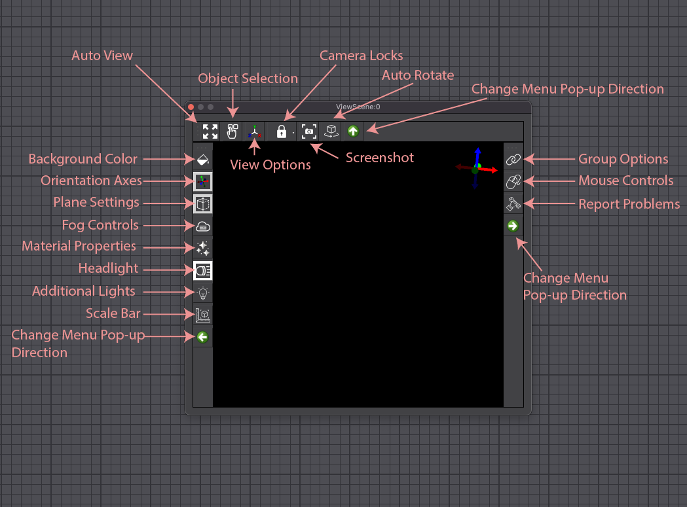

# ViewScene

This module displays interactive graphical output to the computer screen. Use the ViewScene to see a geometry, or spatial data. The ViewScene provides access to many simulation parameters and controls, thus, indirectly initiates new iterations of the simulation steps important to computational steering.

**Detailed Description**

**Autoview** restores the display back to a default condition. This is very useful when objects disappear from the view window due to a combination of settings.

**Set Home View** captures the setting of the current view so you can return to it later by clicking the Go home button. Go home restores the current home view.

Views lists a number of standard viewing angles and orientations. The view directions align with the Cartesian axes of the objects. The Up vector choice sets the orientation of the objects when viewed along the selected axis.

From the ViewScene window, the left corner of the control panel contains performance indicators that document the current rendering speed for the display. More advanced graphics performance results in a higher drawing rate.

The Viewer can be cloned with the **NewWindow** button in the menu. When a new window is created it is locked to the original window, meaning that rotations in one are copied to the other window. This mode is called the 'View Locking Mode' and is indicated with a little 'L' in the lower right corner. To independently rotate the viewers, release the lock by pressing 'L' in the window that needs to be unlocked. If one presses 'L' again the window will return to locking mode in which all the mouse movements are copied to all other windows that have locking mode switched on.

To improve navigation in 3D data and help facilitate the placement of widgets, it is suggested to use multiple windows that view the object from different angles. By pressing 1-8 in the window one can quickly move through different views, that look at the object from different angles.

A small plus sign (**+**) appears in the lower right corner of the ViewScene window. Clicking on the plus sign reveals the extended control panel.

## Hotkeys
The ViewScene module also supports a series of hotkeys:

  * **1-8:** Standard views that align with the cartesian axis.

  * **CTRL 1-9:** Import view from Viewer Window 1-9.

  * **0:** Restore display back to default view (Autoview).

  * **CTRL H:** Capture current view and store it (Set Home View).

  * **H:** Go to captured view (Go Home).

  * **A:** Switch Axes ON/OFF.

  * **B:** Switch Bounding box mode ON/OFF.

  * **C:** Switch Clipping ON/OFF.

  * **D:** Switch Fog ON/OFF.

  * **F:** Switch Flat shading ON/OFF.

  * **I:** Display latest information on hotkeys.

  * **K:** Switch lighting ON/OFF.

  * **L:** Switch view locking ON/OFF.

  * **O:** Switch orientation icon ON/OFF.

  * **P:** Switch orthographic projection ON/OFF.

  * **U:** Switch backculling ON/OFF.

  * **W:** Switch wireframe ON/OFF.

## Tools

:::{figure-md} fig-controls

ViewScene window controls
:::

The ViewScene window contains three toolbars located to the top, right and left of the window (see {numref}`fig-controls`). The tools have the following functions:

### Auto View
restores the display back to a default condition. This is very useful when objects disappear from the view window due to a combination of settings
### Object Selection
### View Options
### Camera Locks
### Screenshot
### Auto Rotate
### Background Color
### Orientation Axes
### Plane Settings
### Fog Controls
### Material Properties
### Headlight
### Additional Lights
### Scale Bar
### Groups
### Mouse Controls
### Report Problems
