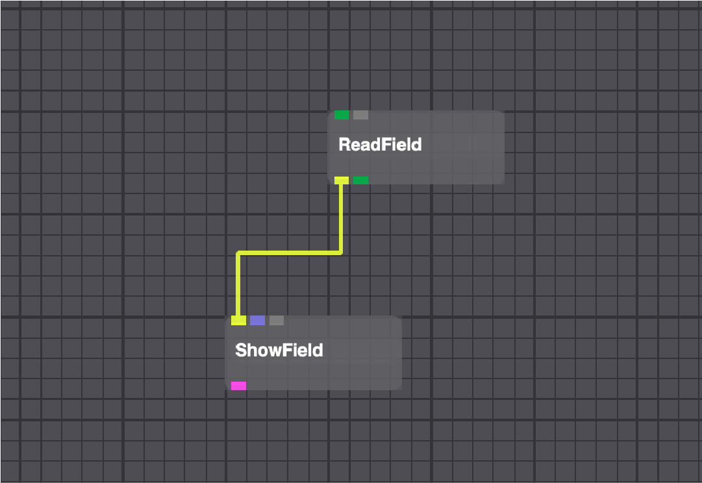

# Classic Tutorial

## Overview
SCIRun is a modular dataflow programming Problem Solving Environment (PSE). SCIRun has a set of Modules that perform specific functions on a data stream. Each module reads data from its input ports, calculates the data, and sends new data from output ports. In SCIRun, a module is represented by a rectangular box on the Network Editor canvas. Data flowing between modules is represented by pipes connecting the modules. A group of connected modules is called a Dataflow Network, or Net (see {numref}`fig-ex-network`). An infinite number of nets can be created, each solving a separate problem.

This tutorial demonstrates the use of SCIRun to visualize a tetrahedral mesh and the construction of a network comprised of three standard modules: ReadField, ShowField, and ViewScene. This tutorial also instructs the user on reading Field data from a file, setting rendering properties for the nodes, edges, and faces (**the nodes are rendered as blue spheres**), and rendering geometry to the screen in an interactive ViewScene window).

### Software requirements

#### SCIRun

All available downloads for SCIRun version and the SCIRunData archive are available from [SCI software portal](https://github.com/SCIInstitute/SCIRun). Make sure to update to the most up-to-date release available, which will include the latest bug fixes.

Currently, the easiest way to get started with SCIRun version is to download and install a binary version for Mac OS X. Sources are also available for Linux, however this option is recommended only for advanced Linux users.

Unpack the SCIRunData archive in a convenient location. Recall from the User Guide that the path to data can be set using the environment variable or by setting in the *.scirunrc* file.

## Starting SCIRun

To open the main SCIRun window, launch SCIRun by either double clicking on the binary icon or by launching SCIRun from the command line. Once SCIRun has been launched, the main SCIRun network editor will appear ({numref}`fig-main-window`).

:::{figure-md} fig-main-window

The main SCIRun window and components
:::

### SCIRun Network Building Blocks: Modules and Connections

Lets begin constructing the network pictured in ({numref}`fig-ex-network`). (Note: subsequent tutorial chapters expand on this network, adding more features and functionality.) This network loads a geometric mesh from a data file and renders it to the screen.

:::{figure-md} fig-ex-window

Network editor after building example network
:::

**Modules**: A module is a single-purpose unit that functions within a dataflow environment. Modules have at least one input port for receiving data, located at the top of the module, or one output port for sending data, located at the bottom of the module ({numref}`fig-module-info`).

All modules have an indicator that alerts the user to messages that exist in a module's log. Different colors represent different types of messages. Gray means no message, blue represents a Remark, yellow a Warning, and red an Error. To read messages, click the module's indicator button to open the log window.

:::{figure-md} fig-module-info

SCIRun Module icon
:::

**Pipes**: Data is transferred from one module to another using dataflow connections, commonly referred to as Pipes. Each dataflow pipe transfers a specific datatype in SCIRun, denoted by a unique color. Pipes run from the output Port of one module to the input Port(s) of one or more other modules. Ports of the same color correspond to the same datatype and can be connected.

Two or more connected modules form a SCIRun network, or net.

## ReadField Module

Now it is time to begin creating a SCIRun dataflow net. First, create a **ReadField** module, which will be used to load a SCIRun Field dataset from disk.

Select **ReadField** under the DataIO section in the module selector located on the left side the the main SCIRun window, as show in ({numref}`fig-module-selection`).

:::{figure-md} fig-module-selection

Module creation (ReadField)
:::

The **ReadField** module will appear on the NetEdit frame. Now, set user interface parameters for this module, by pressing the UI button on the module. This brings up a standard file selection dialog ({numref}`fig-readfield-gui`). Select the utahtorso-lowres/utahtorso-lowres-voltage.tvd.fld input file. (Note: This file can be found in the SCIRunData directory. This directory should have been downloaded and installed when SCIRun was installed.) This dataset contains a low resolution tetrahedral mesh of a human torso.

:::{figure-md} fig-readfield-gui

ReadField file selection GUI
:::

Once the file has been selected, the following will occur:

- The file selection window disappears.
- The module reads in the dataset (a SCIRun Field) and the progress bar turns green.

### Brief Field Overview

A Field contains a geometric mesh, and a collection of data values mapped on to the mesh. Data can be stored at the nodes, edges, faces, and/or cells of the mesh. In this case, a tetrahedral mesh with voltages defined at the nodes of the mesh has been selected.

The dimensionality of the mesh type determines the available storage locations. For example, a TriSurf mesh has nodes, edges, and planar faces, but not cells, which are assumed to be three-dimensional elements. As a result, a TriSurf cannot store data in cells, but can store data in edges or faces.

See [Appendix 1](#appendix-1) for a description of various types of geometric meshes, data values, and mappings SCIRun supports.

## Hooking Modules Together

Now add a second module to the network. This module is used to visualize various Field types. Then connect the two modules in the canvas so data can flow between them.

1. Create a **ShowField** module using the DataIO section in the module selector (use the same menus used to create the ReadField module).
2. Position the mouse pointer over the yellow output port on the **ReadField**. Press and hold the right mouse button. The name of the port and lines indicating possible data pipe connections will appear.
3. Continue to hold the right middle button and drag the mouse toward the first yellow **ShowField** input port.
4. The line turns gray, showing the desired connection has been selected. See ({numref}`fig-pipe-selection`).

:::{figure-md} fig-pipe-selection

Pipe Selection Options
:::

5. Release the mouse button. A yellow pipe showing a data flow connection between **ReadField** and **ShowField** will appear ({numref}`fig-connected-dataflow`).

:::{figure-md} fig-connected-dataflow

Connected Dataflow Pipe
:::

## Dynamic Commpilation

**ShowField** works with all SCIRun Field data types. However, these data types must first be compiled into a shared library (as needed) where they are saved for future use. This process is called "Dynamic Compilation."

Dynamic Compilation causes a delay when the module executes the first time. For more details, refer to [Dynamic Compilation](http://www.sci.utah.edu/publications/mcole01/dyn.pdf).

In addition, the module turns light yellow while it compiles, and compilation output goes to the module's log as a remark. Note that SGI computers can take over 30 seconds to perform dynamic compilation. When compilation is done, the modules color returns to a light gray.

### Setting the ShowField User INTERFACE_MODULES_

The **ShowField** module has options for changing the visual representations of a Field's geometry. To illustrate the module's functionality, change **ShowField** parameters using its GUI. Specifically, change the color of the nodes to blue spheres.

1. Select the UI button on the **ShowField** module.
2. Select the Default Color button near the top of the GUI to change the default color and a separate Color Chooser GUI appears.
3. In the Color Chooser GUI, use the sliders to adjust the color values. Select a blue color.
4. Select the OK button in the Color Chooser GUI. Notice that the Default Color swatch in the ShowField GUI has changed to blue. SCIRun and the ShowField GUI should now look like {numref}`fig-showfield-gui`.
5. Close the Color Chooser GUI.
6. Set the name of the Field to Voltage. This makes it easy to identify the Field in the **ViewScene** Window (discussed later).

:::{figure-md} fig-showfield-gui

ShowField GUI
:::

Now change the scale and resolution of the nodes.

1. In the **ShowField** GUI, a spin box widget represents the Node Scale. The Node Scale interval can be increased or decreased by a power of 10 by pressing the up and down arrows. Set the Scale to 2. Make sure the Node Display Type is set to Spheres.
2. Set the Sphere Resolution to 5.
3. Go to the Edges tab and turn off the display of edges by deselecting the Show Edges check box.
4. Go the the Faces tab and repeat the same action.
5. Close the ShowField GUI by pressing the *Close* button.

The **ShowField** module is ready to render the nodes as blue spheres. The module Interactively Updates, by default, to execute after every user GUI change. Users can select the Execute button only box to delay all changes until the Execute button is pressed. (This is useful with large dataset, when rendering takes a long time.)

## ViewScene modules

The **ViewScene** is the last module that will be added to the network.

1. Create a **ViewScene** module by selecting the module under the Render section in the module selector.
2. Connect the output port from **ShowField** into the **ViewScene** input port. Notice the **ViewScene** module automatically creates a new input port; this is an example of a SCIRun module that has dynamic input ports. This allows the **ViewScene** module to support an infinite number of geometry producing modules.
3. Open the **ViewScene** window by pressing the **ViewScene**'s UI button.
4. In the **ViewScene** window, there is a set of axes, representing X, Y, and Z directions. To make all of geometry piped to the viewer visible, press the Autoview button located on the top menu of the window. (Note: any time the view is changed (scaled, rotated, or translated), and you want the viewer to re-display everything in the center of the screen, use the Autoview button.) At this point, the utah-torso voltage Field should appear in the **ViewScene** window. It should appear similar to {numref}`fig-vs-window`, but will be somewhat different as the figure has been scaled and rotated.

:::{figure-md} fig-vs-window

ViewScene window showing the utahtorso-lowres-voltage data
:::

## Mouse Controls

In the Viewer, the mouse can be used to rotate, scale, and translate the image.

### Translating the image (Left Button)
1. Move the mouse to the center of the image.
2. Click and hold the left mouse button.
3. Move the mouse to translate the image.
4. Release the button, and the image stays in its new location.

### Rotating the image (Middle Button)
1. Click and hold the middle mouse button.
2. Move the mouse to rotate the image.
3. Release the mouse button.
4. If the mouse button is released while dragging, the image will continue to rotate.
5. Click the middle mouse button to stop rotation.

### Scaling the scene (Right Button)
1. Click the right mouse button and drag the mouse.
2. Move the mouse up or to the left to zoom the image out.
3. Move the mouse down or to the right to zoom the image in.

## Setting Visualization Parameters

Now review the tools at the top of the ViewScene window (see {numref}`fig-top-controls`). Buttons at the top of the ViewScene window are used for the following functions:

- Object Selection:
- AutoView:
- Screenshot:
- Lights:
- Axes Controls:
- Locks:

Buttons on the left side of the ViewScene window (see {numref}`fig-left-controls`) are used for the following functions:

- Auto-rotate:
- Scene color:
- Plane settings:
- Fog controls:
-
- Orientation Axes:
- Scale Bar:
- Mouse/Zoom controls:

## Saving and reloading networks

Now that a three-module network has been created, save the net to disk. The net can easily be reloaded in a future SCIRun session.

### Saving a SCIRun network:

1. Click on the File menu (at the top of the Network Editor window) and select "Save As."
2. When the file browser appears, follow the prompt to choose a location and filename for the net. By convention, most nets are stored in the SCIRun/src/nets/ directory, but can be stored in another location.
3. For this example, store the net as SCIRun/src/nets/show-torso-mesh.srn, as in {numref}`fig-save-as`. The .srn suffix is used for SCIRun network files

**Please note, to avoid losing work, it is strongly recommended that nets be saved frequently.**

:::{figure-md} fig-save-as

"Save As" GUI
:::

4. Click the Save button. The network is saved, and the dialog disappears.
5. Exit SCIRun by closing the main SCIRun window or pressing Ctrl-Q.

### Loading a SCIRun network:

1. Start SCIRun.
2. From the File drop-down menu, select the the Load... option.
3. Select SCIRun/src/nets/show-torso-mesh.srn.

The net reloads into SCIRun, where it was previously saved. If the net was saved with any of the module UIs open, those UIs automatically re-open when loaded to the net. After changing module settings (e.g., rotating the image in the ViewWindow or changing the rendering color of the nodes in ShowField), there are two options for re-saving the net:

1. Overwrite existing show-torso-mesh.srn file by using File->Save from the drop-down menu.
2. Save the net to a new file by using File->Save As...

## Appendix 1

SCIRun has nine geometric meshes available for Fields:

- **PointCloudMesh**: unconnected points
- **ScanlineMesh**: regularly segmented straight line (a regular 1D grid)
- **CurveMesh:** segmented curve
- **ImageMesh**: regular 2D grid (see note below)
- **Structured Quad Surface mesh**: surface made of connected quadrilaterals on a structured grid
- **Structured Hex Volume mesh**: subdivision of space into structured hexagonal elements
- **TriSurfMesh**: surface made of connected triangles
- **QuadSurfMesh**: surface made of connected quadrilaterals
- **LatVolMesh**: regular 3D grid
- **TetVolMesh**: subdivision of space into tetrahedral elements
- **HexVolMesh**: subdivision of space into hexagonal elements
- **PrismVolMesh**: five faces, two triangular faces connected together by three quadrilateral faces.

The following data types can be stored in a Field:

- tensor
- vector
- double precision
- floating point
- integer
- short integer
- char
- unsigned integer
- unsigned short integer
- unsigned char
