SCIRun Overview
===============

This tutorial demonstrates how to build a simple SCIRun dataflow network.

Software requirements
---------------------

### SCIRun 

All available downloads for SCIRun version and the SCIRunData archive are available from [SCI software portal](http://www.scirun.org). Make sure to update to the most up-to-date release available, which will include the latest bug fixes.

Currently, the easiest way to get started with SCIRun version is to download and install a binary version for Mac OS X. Sources are also available for Linux, however this option is recommended only for advanced Linux users.

Unpack the SCIRunData archive in a convenient location. Recall from the User Guide that the path to data can be set using the environment variable or by setting in the *.scirunrc* file.

Simple Dataflow Network
=======================

Scope: - - - -

Slice Field
-----------

The purpose of this section is to read, manipulate, and visualize a structured mesh dataset originating from SCIRunData.

### Read Data File

Create a **ReadField** module by using the **Module Selector** on the left hand side of the screen. Navigate to **DataIO** subsection using the scroll bar in the Module Selector and instantiate a ReadField (Figure \[fig:readfield\]). Recall from the **User Guide** that a module can also be selected by giving a text input into the filter in the Module Selector (Figure \[fig:readfield2\]).

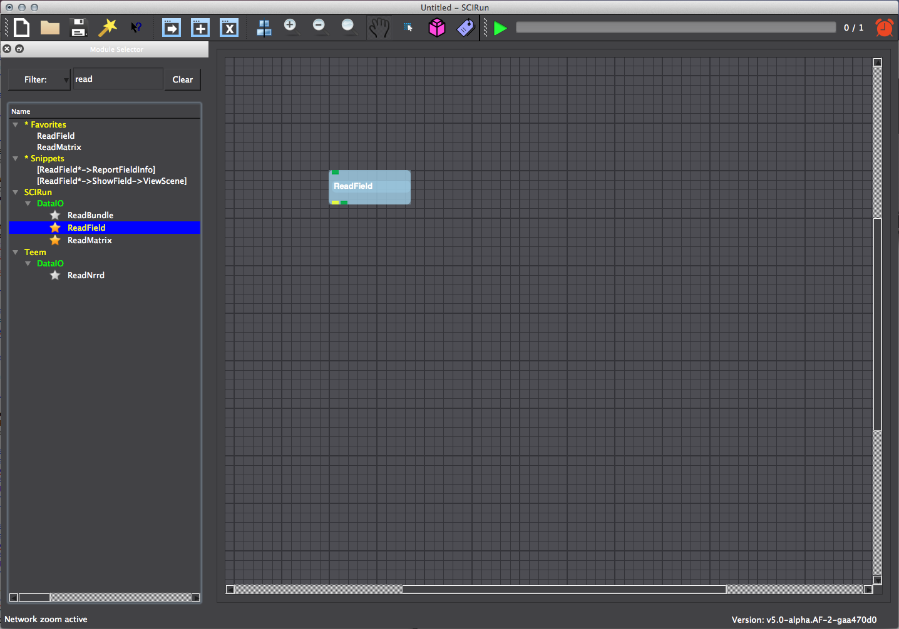

Within the ReadField **user interface (UI)**, click the open button to navigate to the SCIRunData directory and select the dataset *volume/engine.nhdr* (Figure \[fig:readfieldtype\]). Notice that many different file formats can be imported by changing the file type within the ReadField selector window. When using Mac OSX El Capitan, press the options button in the ReadField selector window to change the file type. Change the file type to Nrrd file. The ReadField UI can be closed after selection to provide for a larger network viewing frame.

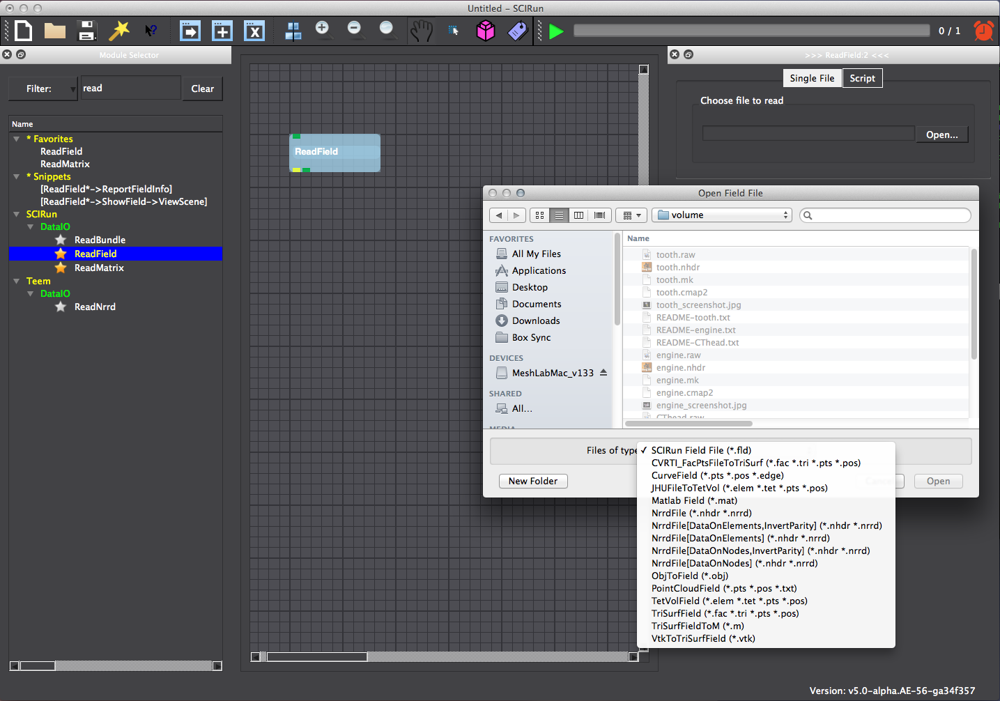

### Slice Field

Slice the engine field by node index along a given axis by instantiating the module **GetSlicesFromStructuredFieldByIndices** in the **NewField** category and connecting it to ReadField (Figure \[fig:slicemod\]). This can be done by using the Module Selector filter or scrolling through the list of modules in the Module Selector.

### Visualize Field

To visualize the field geometry, instantiate module **ShowField** in the **Visualization** category and module **ViewScene** in the **Render** category (Figure \[fig:colormap\]). ShowField takes a field as input, and outputs scene-graph geometry. ViewScene displays the geometry and allows a user to interact with the scene.

Apply a colored scale to the data values on the geometry using **CreateStandardColorMaps** and **RescaleColorMaps** modules in **Visualization** (Figure \[fig:rescale\]). Colors can be manipulated using the CreateStandardColorMap UI and RescaleColorMap UI (Figure \[fig:viewscene\]). Change the coloring scheme to Blackbody using the drop-down menu in the CreatSrandardColorMap UI.

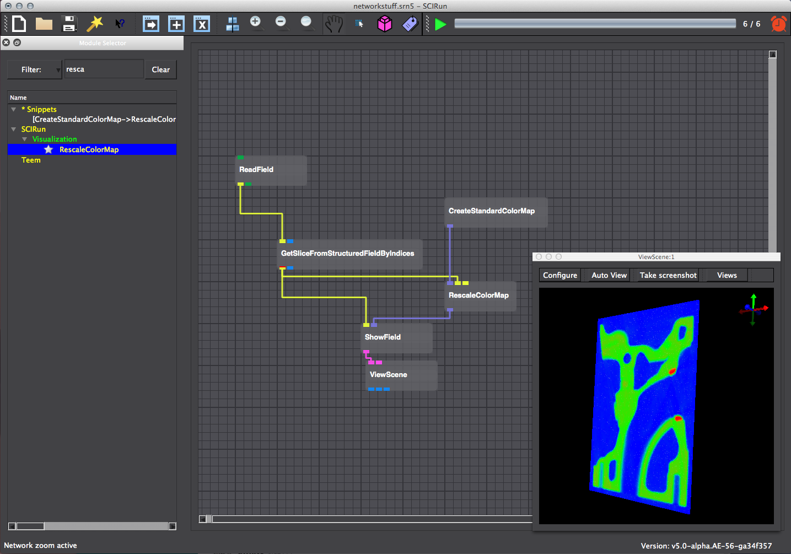

Return to the default color scale. Use the sliders in the GetSlicesFromStructuredFieldByIndices UI to change slice position within the geometry. Compare with figure \[fig:rescale\].

Show Bounding Box
-----------------

Add the **EditMeshBoundingBox** module under **ChangeMesh** (Figure \[fig:addbbox\]). Connect it to the ReadField module and direct the output to the ViewScene module. Execute the network to visualize the bounding box of engine.nhrd. Adjust the size of the bounding box by pressing the + or - buttons under Widget Scale in the EditMeshBoundingBox UI (Figure \[fig:addbbox2\]).

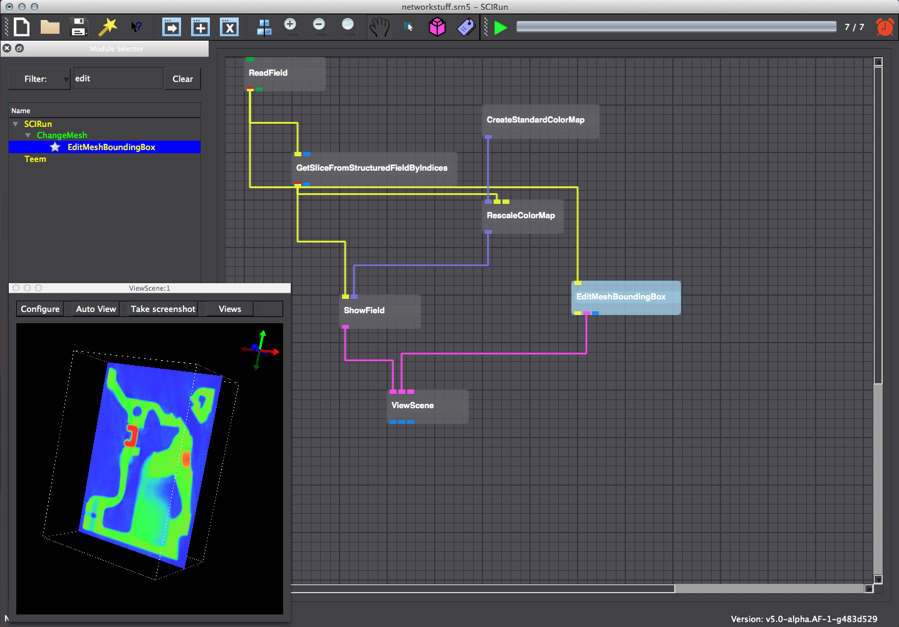

Isosurface
----------

Construct an isosurface from the field by instantiating and connecting a **ExtractSimpleIsosurface** module to the ReadField module. The isovalue must be changed within the ExtractSimpleIsosurface UI. Open the field information by clicking on the connection between the ReadField and ExtractSimpleIsosurface and press I to bring up information. Enter a value from within the data range like 120. Visualize the isosurface by connecting it to a new ShowField module ported into the ViewScene module (Figure \[fig:extract\]). Execute the network. Color isosurface output geometry by connecting the RescaleColorMap module to the ShowField module (Figure \[fig:changeisoval\]). To better view the geometry, turn off the edges within the ShowField UI (Figure \[fig:viewisosurf\]).

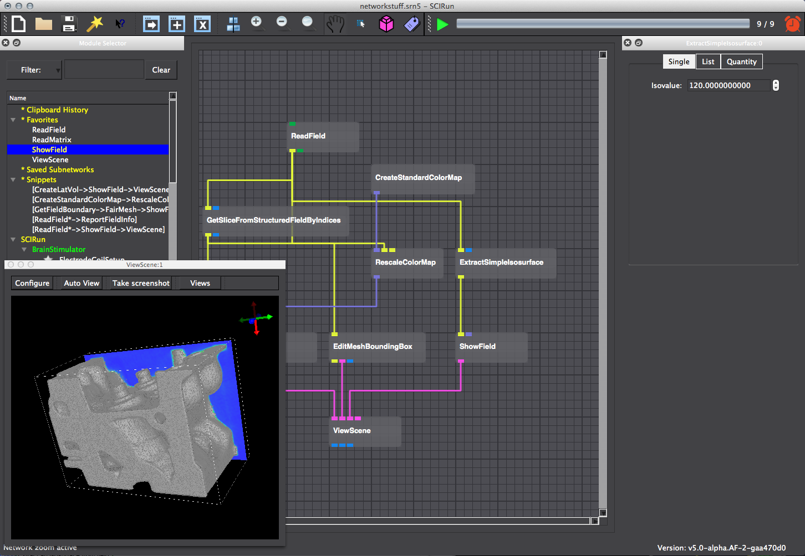

Create, Manipulate and Visualize Field
======================================

Scope: - -

Create Field
------------

Create and manipulate a structured mesh type in this exercise. Start by creating a lattice volume using **CreateLatVol** module. Assign data at nodes using **CalculateFieldData** module. Connect CalculateFieldData to CreateLatVol. Input the expression *R**E**S**U**L**T* = *s**q**r**t*(*X* \* *X* + *Y* \* *Y* + *Z* \* *Z*) to compute data for each node within the CreateFieldData UI.

Isosurface
----------

Generate the isosurface by instantiating and connecting an ExtractSimpleIsosurface module to CalculateFieldData (Figure \[fig:extractisosurf2\]). Adjust the isovalue within the ExtractSimpleIsosurface UI so that the isosurface can be visualized (Figure \[fig:conncolormap\]). Add a color map and visualize the isosurface as in section \[isosurface\] (Figure \[fig:viewdefaultisosurf\]). Show the mesh bounding box as in section \[bbox\] (Figure \[fig:changeisoval2\]).

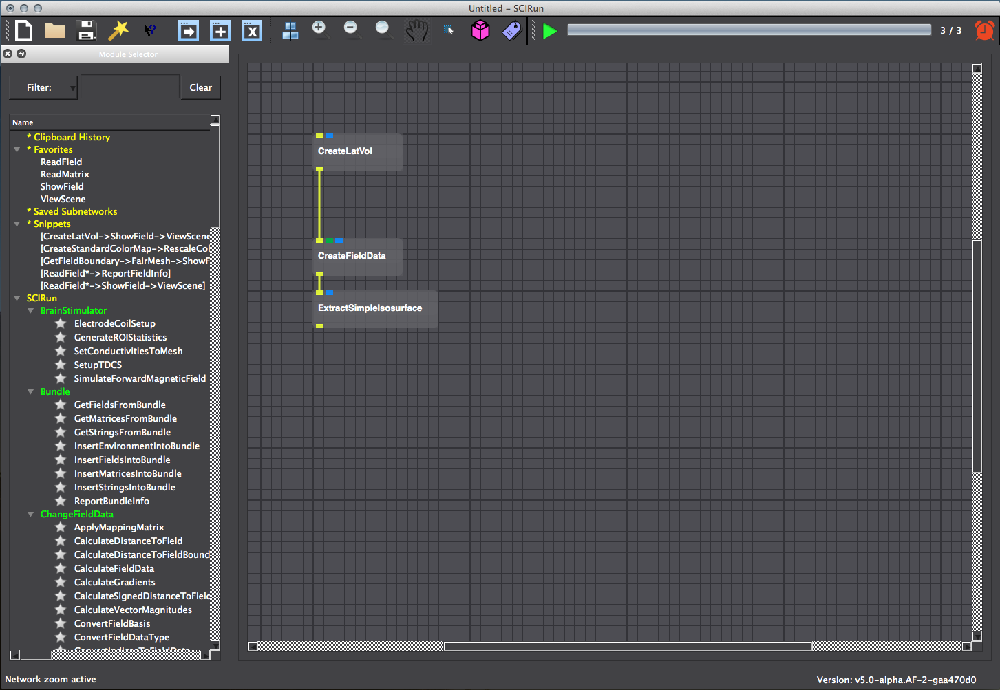

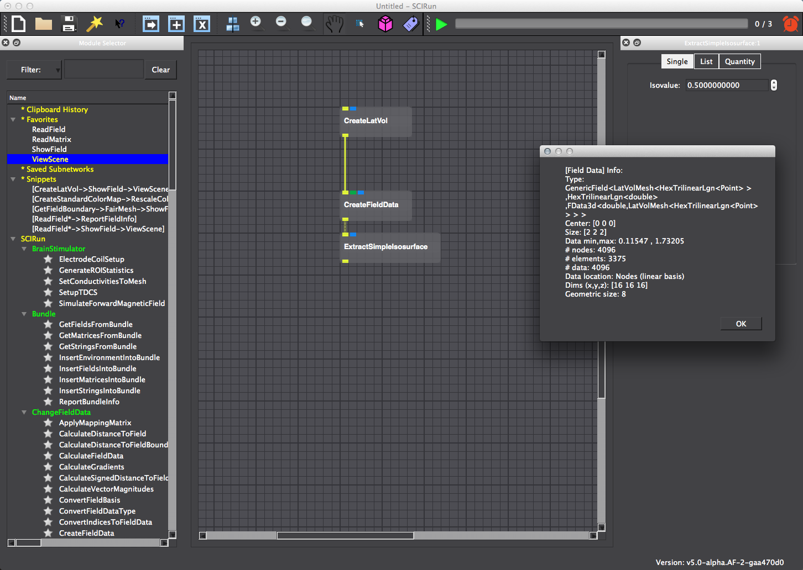

Slice Field
-----------

Extend the functionality of this network by slicing the field using GetSliceFromStructuredFieldByIndices as in section \[slice\].

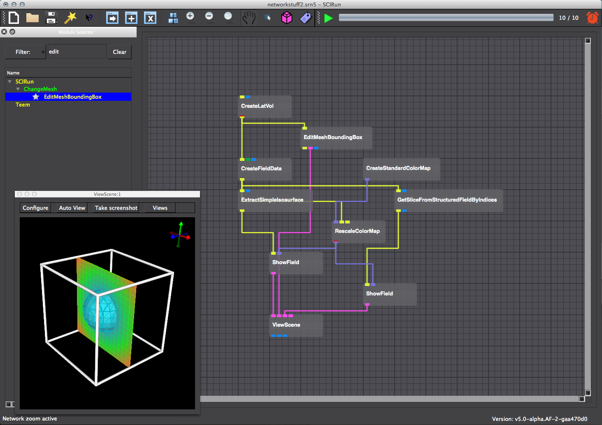

Clip Field
----------

Clip out a subset of the original field by converting the lattice volume to an unstructured mesh using **ConvertMeshToUnstructuredMesh** (Figure \[fig:convertmesh\]) and adding **ClipFieldByFunction** (Figure \[fig:clipfield\]) to the network. Set the clipping location setting in ClipFieldByFunction to *all nodes*. Use the expression *D**A**T**A*1 &gt; 1&&*X* &lt; 0 to clip the field (Figure \[fig:clipfield\_input\]).

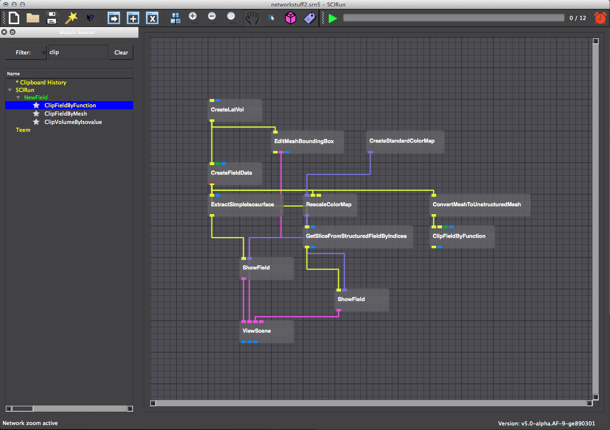

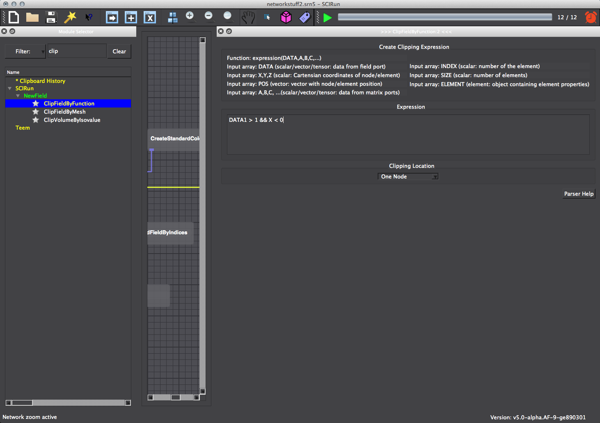

### Extract Boundary

At this point, it will be necessary to map the fields by interpolating the the boundary surface field to the clipping field. First, use **BuildMappingMatrix** to build a matrix that maps a linear combination of data values in the clipping field to a value in the boundary field. Then use **ApplyMappingMatrix** to multiply the data vector of the clipping field with the mapping matrix to obtain the data vector for the boundary surface field (Figure \[fig:mappingmatrix\]). Use GetFieldBoundary to extract the boundary surface from the lattice volume and use it as input into the ApplyMappingMatrixModule and BuildMapping Matrix (Figure \[fig:highlightmods\]). Port the output from the BuildMappingMatrix module to ApplyMappingMatrix and visualize the resultant field using a ShowFieldModule (Figure \[fig:viewbound\]). Add a colormap to and enable transparency in ShowField UI for further functionality (Figure \[fig:finalview\])

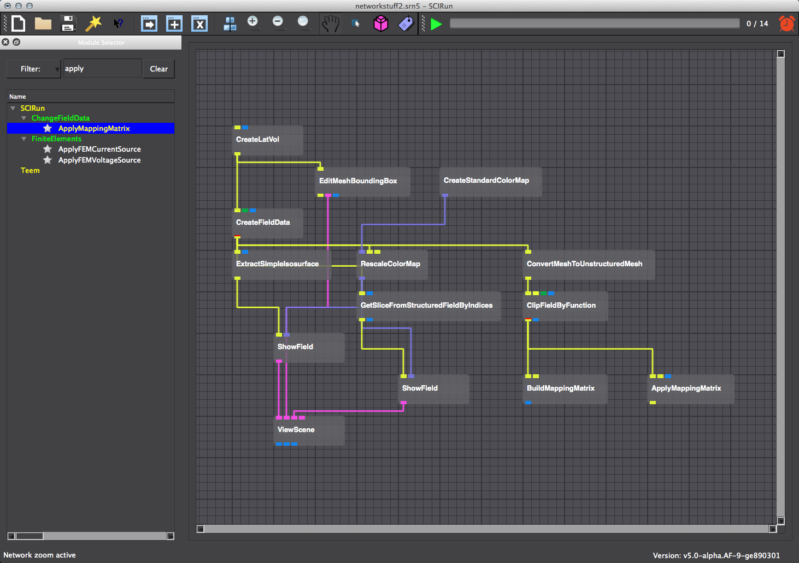

Finally, it is not strictly necessary to explicitly convert the original mesh to an unstructured mesh using ConvertMeshToUnstructuredMesh because ClipFieldByFunction can implicitly convert structured mesh types to unstructured mesh types before clipping the field. As a final exercise, delete ConvertMeshToUnstructuredMesh from the network and try to obtain the same result.
